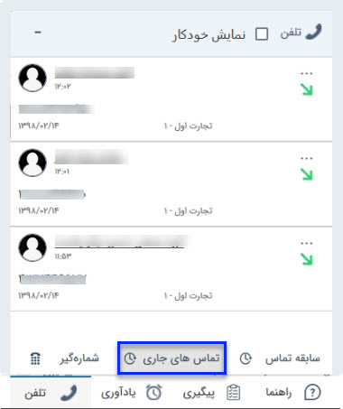

# برقراری تماس و مشاهده لیست تماس‌ها در نوار دسترسی

 قسمت تلفن در نوار دسترسی این امکان را به شما می‌دهد که در هر صفحه/بخش از نرم‌افزار بتوانید با شماره مورد نظر تماس بگیرید، تماس‌‌های جاری را مشاهده کنید و به لیست تماس‌های اخیر خود دسترسی داشته باشید. 
 
 
 امکانات این بخش به شرح ذیل می‌باشد: 
1. **سابقه تماس** 
این بخش ۱۰ تماس‌ دریافتی خاتمه‌یافته اخیر را نمایش می‌دهد. شما می‌توانید تعداد تماس‌های نمایش داده شده در این بخش را از طریق [**تنظیمات من**](https://github.com/1stco/PayamGostarDocs/blob/master/Help/home/my-setting/my-setting.md) تغییر دهید. توجه داشته باشید تماس‌های ثبت شده در این بخش پس از بروزرسانی صفحه پاک خواهد شد. 

 2. **تماس‌های جاری** 
این بخش تماس‌هایی که در حال حاضر روی خط برقرار هستند را نشان می‌دهد. 

به هنگام دریافت تماس، با توجه به جدید بود و یا نبودن شماره تماس‌گیرنده حالت‌های زیر رخ می‌دهد: 
 -  **شماره شناس:** اگر شماره تماس‌گیرنده پیش‌تر در یکی از پروفایل‌های بانک اطلاعاتی (به عنوان شماره تماس یک هویت) ذخیره شده باشد، نام و نام خانوادگی شخص/نام شرکت به عنوان تماس‌گیرنده نمایش داده می‌شود. در این حالت با کیک بر روی نام هویت می‌توانید به راحتی به پروفایل ایشان دسترسی داشته باشید؛ در صورت لزوم از سوابق موجود در صفحه هویت استفاده نمایید و یا سابقه جدیدی  مرتبط با آن  ثبت کنید. 
 - **مخاطب جدید:** در صورتی که شخص تماس‌‌گیرنده مخاطب جدید باشد می‌توانید با کلیک بر روی شماره، یک صفحه جدید برای تعریف هویت باز کنید. توجه داشته باشید که در این حالت شماره به فیلد نام هویت انتقال مییابد. به خاطر داشته باشید که شماره را به قسمت راه‌های ارتباطی منتقل کنید. 
 - **هویت با شماره جدید:** در صورتی که پروفایل شخص تماس‌گیرنده در سیستم موجود بوده اما با شماره‌ی جدیدی تماس گرفته باشد، می‌توانید این شماره را به شماره‌ تماس‌های مخاطب مورد نظر اضافه کنید. در این صورت از گزینه «اضافه به...»  استفاده کنید و با جستجوی پروفایل مورد نظر و زدن کلید «انتخاب و بستن»، شماره را به پروفایل او اضافه کنید. در انتها بر روی ذخیره کلیک نمایید تا تغییر در پروفایل ثبت شود. 
 > **نکته**
 > شما می‌توانید سیستم را برای ذخیره خودکار شماره‌های ناشناس تنظیم کنید. در این حالت تمامی تماس‌گیرندگان (شماره‌های) ناشناس به عنوان یک هویت (سرنخ/مخاطب) در دسته‌بندی تعیین شده ذخیره می‌شود. بدین منظور از راهنمای [تنظیمات مخاطبان ناشناس](https://github.com/1stco/PayamGostarDocs/blob/master/Help/Settings/General-settings/Anonymous-audience/Anonymous-audience.md) جهت تنظیمات لازم برای فعال‌سازی این قابلیت، تعیین نوع هویت و دسته‌بندی مورد نظر جهت ذخیره مخاطب استفاده نماید. 

 3. **شماره‌گیر** 
  با استفاده از شماره‌گیر می‌توانید مستقیما از نرم‌افزار با شماره مورد نظر خود تماس بگیرید. داخلی شما در کادر سمت راست تصویر قابل مشاهده می‌باشد. 

> **نکته** 
> استفاده از این قابلیت مستلزم تخصیص داخلی به کاربر و همچنین اعطای مجوز برقراری تماس به ایشان است.
>> این قابلیت فقط در سیستم‌های ویپ قابل استفاده است.

    
