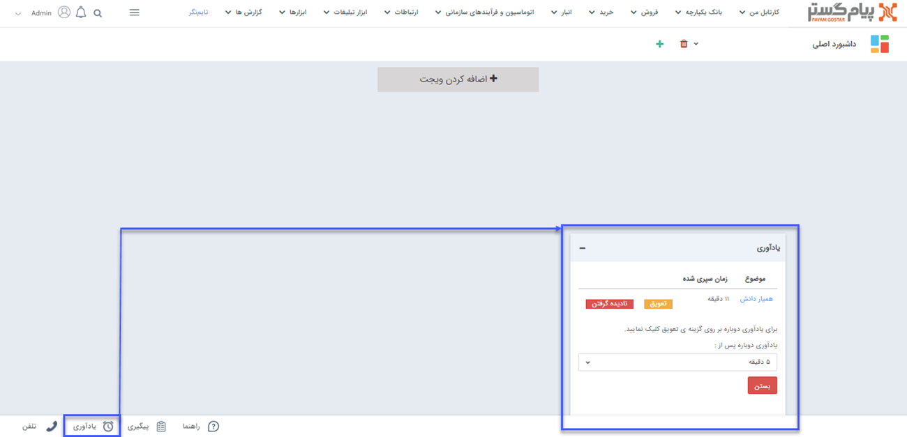

# مشاهده یادآوری‌ها در نوار دسترسی

 با انتخاب این گزینه در هر صفحه از نرم‌افزار، کادر یادآوری باز می‌شود (در صورت عدم شناخت کافی از قابلیت یادآوری ابتدا مقاله مربوط به [ثبت پیگیری و یادآوری](https://github.com/1stco/PayamGostarDocs/blob/master/Help/Integrated-bank/Database/General-specifications/Reminder-and-follow-up/Reminder-and-follow-up.md) را مطالعه کنید). 

 

 در این کادر می‌توانید تمامی یادآوری‌هایی که به تعویق انداخته‌اید و یا بسته‌اید را مشاهده نمایید. به عبارت دیگر، تمامی یادآوری‌هایی که زمان آن‌ها فرارسیده و شما اتمام آن را اعلام نکرده باشید در این بخش نمایش داده می‌شود. به تعویق انداختن و یا نادیده گرفتن هر یک از یادآوری‌های ثبت شده، از همین بخش امکان‌پذیر می‌باشد.
