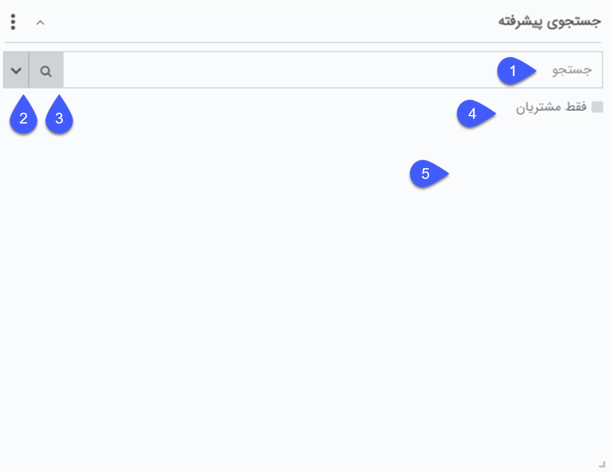

# ویجت جستجوی پیشرفته 
 با استفاده از ویجت جستجوی پیشرفته می‌توانید به راحتی هویت مورد نظر خود را با استفاده از نام خانوادگی/هویت حقوقی و یا شماره مشتری ایشان جستجو کنید. 
 
 
 
 **1**. عبارت مورد نظر خود را در این قسمت وارد کنید. توجه داشته باشید که از این قسمت فقط امکان جستجو بر اساس **نام خانوادگی** هویت حقیقی، **نام هویت حقوقی** و **شماره مشتری** امکان‌پذیر است.

**2**.  در صورت نیاز به جستجو بر اساس **تلفن همراه**، شماره **تلفن**، آدرس **ایمیل**، **نام** شخص و یا **نام مدیر** شرکت با کلیک بر روی فلش کناری اطلاعات مورد نظر را در بخش مربوطه وارد نمایید (مثلا زمانی که قصد پیدا کردن صاحب یک شماره تلفن را دارید). با کلیک بر روی گزینه جستجو وارد صفحه جستجو پیشرفته می‌شوید. برای دیدن نتایج یافت شده در پایین صفحه قسمت **نتایج جستجو** را باز و مشاهده نمایید.

**3**. چنانچه با استفاده از سایر اطلاعات (نظیر نام تجاری) قصد یافتن یک هویت را دارید عبارت مورد نظر را در بخش جستجو نوشته و با کلیک بر روی آیکون ذره‌بین وارد صفحه جستجوی پیشرفته شوید. عبارت مورد نظر به صورت خودکار وارد بخش [جستجوی سریع](https://github.com/1stco/PayamGostarDocs/blob/master/Help/Integrated-bank/Advanced-search/Advanced-search.md#QuickSearch) شده و بدین ترتیب هر هویتی که در هر فیلد اطلاعاتی او عبارت مورد نظر شما درج شده باشد در نتایج جستجو (قابل مشاهده درپایین صفحه) نمایش داده می‌شود.

**4**. در صورت فعال کردن این گزینه جستجو تنها از میان هویت‌هایی که دارای شماره مشتری هستند انجام خواهد شد.

> **نکته** 
>  در هر جستجو فقط تعداد 10 پروفایل در این ویجت نمایش داده می‌شود و اولویت نمایش با پروفایل‌هایی است که شماره مشتری دارند. در صورت نیاز به تعداد بیشتری از پروفایل‌ها با کلیک بر روی آیکون ذره‌بین وارد بخش [جستجوی پیشرفته](https://github.com/1stco/PayamGostarDocs/blob/master/Help/Integrated-bank/Advanced-search/Advanced-search.md) می‌شوید. 
