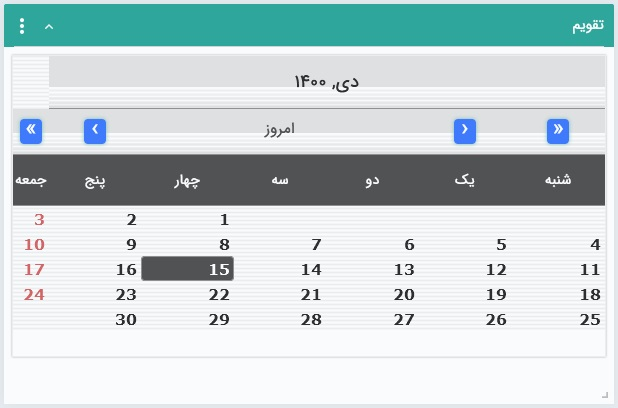

# ویجت تقویم  
 
با انتخاب این ویجت شما یک تقویم شمسی را که تنها ایام هفته و تاریخ را نمایش می‌دهد، روی داشبورد حساب کاربری خود اضافه خواهید کرد. لازم به ذکر است که مناسبت‌های تعریف شده در سیستم با این تقویم ارتباطی ندارد. 

> **نکته** 
>توجه داشته باشید که به جز روزهای جمعه، سایر تعطیلات در ویجت تقویم نمایش داده نمی‌شود. مناسبت‌‌های تعریف شده در سیستم در بخش «[مدیریت اعیاد و مناسبت‌ها](https://github.com/1stco/PayamGostarDocs/blob/master/Help/Basic-Information/Holiday-management-and-occasions/Holiday-management-and-occasions.md) » نیز صرفاً در تقویم کاری قابل رویت بوده و در ویجت تقویم‌ها تغییری ایجاد نمی‌کند. 