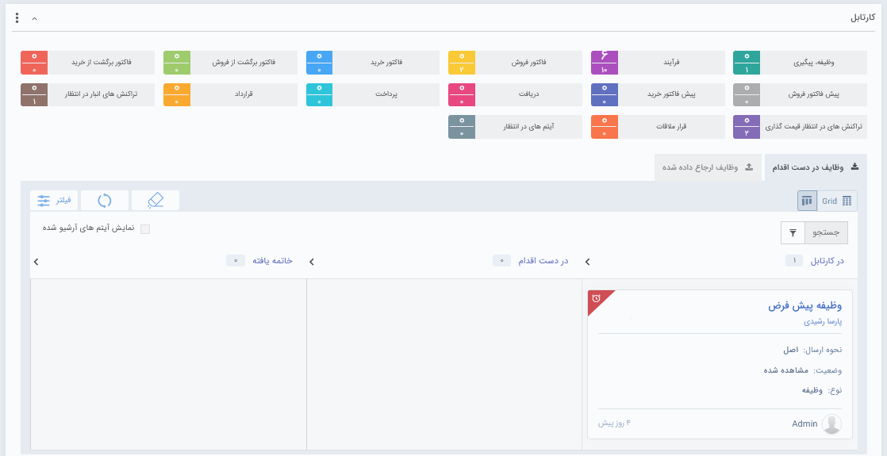
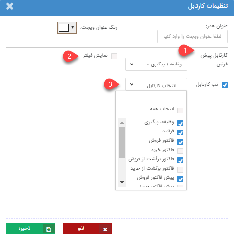

# ویجت کارتابل 
 ویجت کارتابل را می‌توان به میز کار شما در نرم‌افزار شبیه دانست. این ویجت در واقع دسترسی آسان‌تر به بخش «کارتابل من» (موجود در نوار منو در بالای صفحه اصلی) را فراهم می‌آورد؛ با این تفاوت که امکان ایجاد آیتم جدید از طریق این ویجت وجود ندارد (این قابلیت در تب کارتابل من فراهم می‌باشد). در این قسمت کارهای ارجاع شده به شما (مانند تایید/رد آیتم‌های مالی، فرایندها و ... )  در دسته‌بندی‌هایی که در تصویر زیر قابل مشاهده است، نمایش داده می‌شوند. 
 
 

در قسمت بالایی ویجت، کارتابل‌ آیتم‌های مختلف (مانند فاکتور فروش، فرآیند و...) برای شما نمایش داده می‌شود. با کلیک بر روی هر یک از آن‌ها، در قسمت پایین ویجت، آیتم‌هایی که مسئولیتی برای انجام در آن دارید به شما نمایش داده می‌شود. به عنوان مثال با کلیک بر روی فاکتور فروش، فاکتورهای فروشی که برای تایید و شماره‌گذاری آن‌ها باید اقدام کنید به شما نمایش داده می‌شود. از همین بخش می‌توانید اقدامات لازم در خصوص هر یک را به انجام برسانید. 

> **نکته** 
> چهار کارتابل **وظیفه/پیگیری**، **فرآیند**، **قرارملاقات** و **آیتم‌های در انتظار** برای همه‌ی کاربران در این بخش قابل رویت می‌باشد. سایر آیتم‌ها تنها در صورتی که کاربر مجوز تایید/رد و شماره‌گذاری آن موجودیت را داشته باشد برای او نمایش داده می‌شود. 

عددی که رو به روی هر کارتابل نمایش داده می‌شود نشانگر نسبت تعداد کارهای مشاهده نشده‌‌ای است که امروز (از 12:01 بامداد) وارد آن کارتابل شده (عدد بالایی) به کل کارهایی که در آن کارتابل وجود دارد (عدد پایین) است. 

## کارتابل‌ها
کارتابل‌های قابل مشاهده در این بخش، با توجه به نوعشان کاربردهای متفاوتی دارند:

- **وظیفه، پیگیری:** با کلیک بر روی این کارتابل، تمامی وظیفه‌‌هایی که به شما ارجاع داده شده، وظیفه‌هایی که برای خودتان ثبت کرده‌اید و تمامی پیگیری‌هایی که تنظیم کرده‌اید، نمایش داده می‌شود. در صورت نیاز می‌توانید به توضیحات بخش [کارتابل رسیدگی به وظایف و پیگیری](https://github.com/1stco/PayamGostarDocs/blob/master/Help/home/widget/Cardboard/Task-tracking/2.6.0/Task-tracking.md) مراجعه کنید 

- **فرآیند:** فرایندهایی که مسئولیتی برای انجام کار در آن دارید، در این قسمت به دست شما میرسد. به عبارت دیگر، اگر در مرحله‌ای از فرایند شما به عنوان مسئول آن کارتابل انتخاب شده باشید، فرایند در این قسمت به شما نمایش داده می‌شود. فرایندهایی که هنوز اقدام لازم را در آن به انجام نرسانده باشید در بخش «در دست اجرا» و فرایندهایی که اقدام مورد نیاز آن را انجام داده باشید در بخش «ارجاع شده» قرار می‌گیرند. برا مطالعه بیشتر در این مورد به بخش «[مشاهده مسئولیت‌های کاربر در کارتابل](https://github.com/1stco/PayamGostarDocs/blob/master/Help/home/widget/Cardboard/widget-processes/2.6.0/widget-processes.md)» مراجعه کنید. 

- **آیتم‌های در انتظار:** فرایندهایی که برای رسیدن زمان موعد در انتظار هستند و شما به عنوان مسئول انتظار آن انتخاب شده باشید، در این قسمت نگهداری می‌شود. در این حالت می‌توانید از این قسمت به انتظار فرایند به صورت دستی خاتمه دهید. در صورت تمایل به مطالعه بیشتر در مورد انتظار به بخش [کارتابل آیتم‌های در انتظار](https://github.com/1stco/PayamGostarDocs/blob/master/Help/home/widget/Cardboard/entezar/Cardboard.md) مراجعه نمایید. 

- **قرارملاقات:** قرارملاقات‌هایی که در آن دعوت شده‌اید و هماهنگ‌کننده جلسه برای حضور شما تایید خواسته است در این قسمت به شما نمایش داده می‌شود. از این قسمت می‌توانید تایید/رد/شاید را به عنوان نتیجه این دعوت اعلام نمایید. قرارملاقات تنها در صورتی در این بخش به شما نمایش داده می‌شود که به هنگام تنظیم قرارملاقات توسط هماهنگ‌کننده «درخواست تایید حضور» برای شما (مدعو) فعال شده باشد. 

- **تراکنش‌های انبار در انتظار:** اگر مسئول تایید/رد آیتم‌های انبار (رسیدها و حواله‌ها) باشید،‌این آیتم‌ها در این بخش به شما نمایش داده می‌شود. 

- **آیتم‌‌های مالی:** سایر آیتم‌ها شامل **فاکتور فروش**، **فاکتور خرید**، **فاکتور برگشت از فروش**، **فاکتور برگشت از خرید**، **پیش‌فاکتور فروش**، **پیش‌فاکتور فروش**، **پیش‌فاکتور خرید**، **دریافت**، **پرداخت** و **قرارداد** در صورتی که مسئول تایید و/یا شماره‌گذاری آن موجودیت باشید (یعنی مجوز تایید/رد و یا مجوز شماره‌گذاری آن موجودیت را داشته باشید) در این قسمت برای اخذ تایید به دست شما می‌رسد. 

## تغییر رنگ آیتم‌ها در کارتابل
با توجه به تاریخ‌های قابل اهمیت در آیتم‌ها،‌ گذشت فیلدهای تاریخی مهم (به عنوان مثال تاریخ مقرر انجام وظیفه) با تغییر رنگ رکورد به شما هشدار داده می‌شود. این هشدارها به طور خلاصه به شرح زیر می‌باشد: 
در بخش وظیفه، پیگیری: 

- در بین وظیفه‌ها، در صورتی که از تاریخ **موعد مقرر** رکورد ثبت‌شده گذشته باشد، آن رکورد با مثلث قرمز رنگ بالای رکورد در حالت نمایش کانبان مشخص می‌شود. 
- در بین پیگیری‌ها، در صورتی که از زمان **موعد** پیگیری گذشته باشد، آن رکورد با مثلث زرد رنگ بالای رکورد در حالت نمایش کانبان مشخص می‌شود. 

در بخش فرآیند: 
- در بین فرآیندهای وارد شده به کارتابل شما، در صورتی که از زمان **یادآوری** تعیین شده برای کارتابل گذشته باشد، آن رکورد به رنگ زرد تغییر پیدا می‌کند. 
- در بین فرآیندهای وارد شده به کارتابل شما، در صورتی که از زمان **انقضا** و یا **بحرانی** تعیین شده برای کارتابل گذشته باشد، آن رکورد به رنگ قرمز تغییر پیدا می‌کند. 

## ویرایش تنظیمات ویجت کارتابل
در ویجت کارتابل، علاوه بر قابلیت تنظیم اندازه، جایگاه، رنگ و عنوان که در «[ویجت چیست](https://github.com/1stco/PayamGostarDocs/blob/master/Help/home/widget/Widgets2.7.0.md#WidgetSetting) » توضیح داده شد، امکان تعیین آیتم‌های نمایش داده شده نیز وجود دارد. بر این اساس در قسمت تنظیمات این ویجت، موارد نمایش داده شده در تصویر به شرح زیر می‌باشد: 

1. در حالت اولیه و به هنگام اضافه کردن ویجت کارتابل،‌ «وظیفه، پیگیری» به صورت پیش‌فرض در قسمت پایین ویجت برای شما نمایش داده می‌شود. این بدین معناست که قبل از کلیک بر روی کارتابل دیگر، کارتابل پیش‌فرض برای نمایش «وظیفه، پیگیری» می‌باشد. در صورت تمایل به تغییر آن می‌توانید کارتابل مورد نظر را از این قسمت انتخاب و تنظیمات خود را ذخیره نمایید. 
بدیهی است که انتخاب پرکاربردترین کارتابل به عنوان پیش‌فرض می‌تواند در سهولت بخشیدن به کار شما کمک کند. 
2. با فعال کردن این گزینه، امکان فیلتر در ویجت کارتابل ایجاد می‌شود. در این حالت در با انتخاب هر کارتابل در ردیف بالا آیکون فیلتر قابل مشاهده است. 
3. از این قسمت می‌توانید کارتابل‌های مورد نیاز خود را به منظور نمایش در این ویجت انتخاب کنید. بر این اساس، تنها کارتابل‌هایی که شما انتخاب کرده‌اید در ویجت نمایش داده می‌شود. 
به جهت اعمال شدن تغییرات و ویرایش‌های انجام شده در تنظیمات، بر روی **ذخیره** کلیک نمایید.

