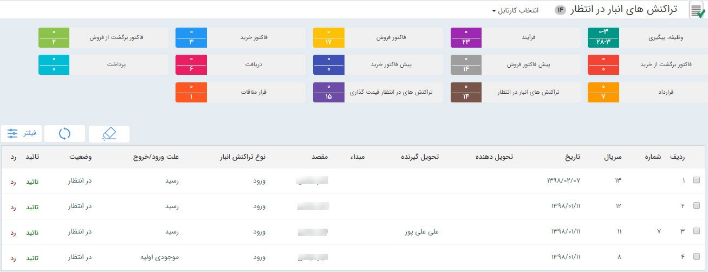
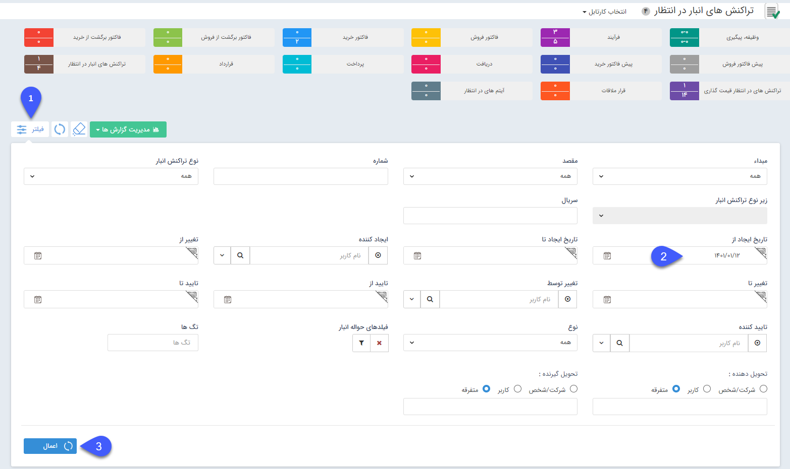

# کارتابل تراکنش‌های انبار در انتظار 

در صورتی که از سیستم انبارداری پیشرفته پیام گستر استفاده می کنید، تراکنش‌های انبار([رسید موجودی اولیه، رسید و حواله](https://github.com/1stco/PayamGostarDocs/blob/master/Help/Buy-warehouse-sales/Store/sabthavale-resid/moshtarak-resid-havale.md)) نیاز به تایید و قیمت گذاری دارند . در صورتی که مجوز تایید هر کدام از زیرنوع‌های تراکنش انبار را داشته باشید و در تنظیمات آن تراکنش در قسمت شخصی سازی، گزینه‌ی "نیاز به تایید دارد" را فعال کرده باشید، پس از صدور هر تراکنش می توانید آن را در قسمت تراکنش‌های انبار در انتظار مشاهده کرده و آن را تایید یا رد کنید.

> **نکته:** برای اینکه بتوانید یک تراکنش انبار صادر شده را تایید کنید، باید مجوز تایید آن زیر نوع تراکنش (منظور از زیر نوع تراکنش برای مثال حواله انبار پیش فرض)  در قسمت مدیریت مجوزها و همچنین مجوز تایید آن نوع تراکنش (حواله) در قسمت مدیریت انبار ، مدیریت  مجوزهای انبار  مربوطه را داشته باشید

همچنین  با دو بارکلیک بر روی هر کدام از تراکنش‌های موجود در کارتابل می‌توانید آن را مشاهده کنید.

> به خاطر داشته باشید در حالت پیش‌فرض لیست تراکنش‌های یک‌ماه اخیر را مشاهده می‌کنید، برای مشاهده تراکنش‌های بیشتر باید همانند تصویر زیر از منوی فیلتر بازه‌‌ی زمان مورد نظر خود را اعمال کنید.

