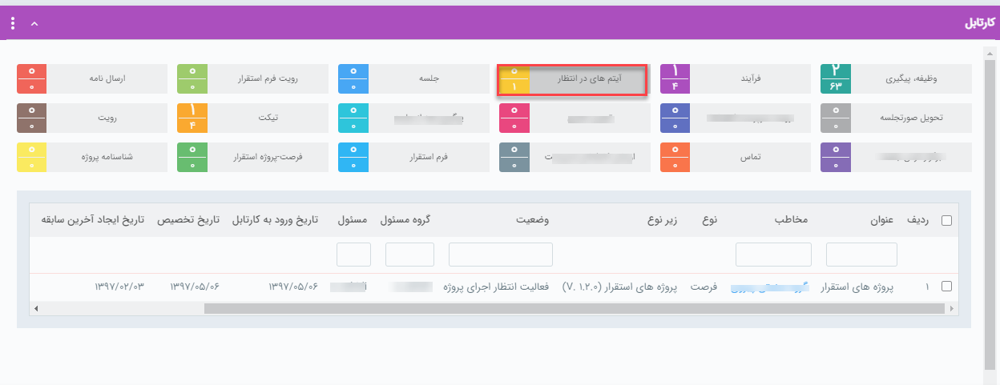

#  مشاهده فرآیندهای متوقف شده از کارتابل آیتم‌های در انتظار  

آیتم‌هایی که طی فرآیند توسط کاربر به [فعالیت انتظار](https://github.com/1stco/PayamGostarDocs/blob/master/help2.5.4/Settings/Personalization-crm/Overview/Process-design/Create-a-work-cycle/Activity/Waiting/Waiting.md) منتقل شدند تا زمانی که از انتظار خارج نشوند در این بخش قابل مشاهده می‌باشد. 

می‌توان با کلیک بر روی آیتم موردنظر آن آیتم را مشاهده و از انتظار خارج کرد. 

