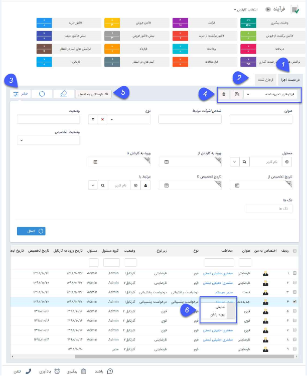

#  مشاهده مسئولیت‌های کاربر در کارتابل فرآیند    

 در این قسمت می توانید تمام فرآیندهایی که توسط [چرخه‌ها و گردش‌های کاری](https://github.com/1stco/PayamGostarDocs/blob/master/Help/Category-docs/Process-management.md) برای شما ارسال شده است را مشاهده کنید.
 

 
 **1. در دست اجرا:** لیست آیتم‌های تحت چرخه که در مرحله جاری شما به‌عنوان مسئول آن انتخاب شده اید در این قسمت نمایش داده می‌شود .

**2. ارجاع شده:** لیست آیتم‌های تحت چرخه که اقدام آن توسط شما انجام شده است و به مرحله دیگری منتقل گردیده است .

**3. فیلتر:** فیلترهای مختلفی را برای یافتن  فرآیند موردنظر میتوانید استفاده کنید.

**4. فیلترهای ذخیره شده:** می‌توانید فیلتر دلخواه را ذخیره کنید.

> **نکته:** فیلتر ذخیره شده به عنوان یک کارتابل جدید نمایش داده می‌شود و در صورتی که فرایندی با فیلترهای اعمال شده وارد کارتابل شما شود علاوه بر کارتابل فرایندها به صورت مجزا در کارتابلی با نام ذخیره شده نمایش داده خواهد شد .

**5. فرستادن به اکسل:** لیست فرایندها را می‌توانید در قالب یک فایل اکسل خروجی بگیرید.

**6. گزینه‌‍های راست کلیک:** با راست کلیک بر روی یک فرآیند یا فرآیندهایی که در یک مرحله کاری هستند می‌توانید بدون باز کردن آن آیتم ها، با مشاهده اقدام ها، آنها را به مراحل دیگر منتقل کنید. 
