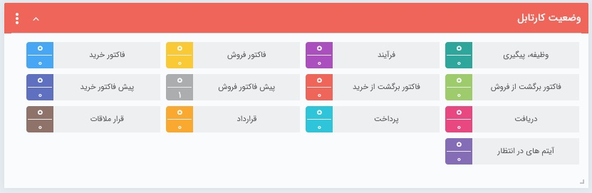
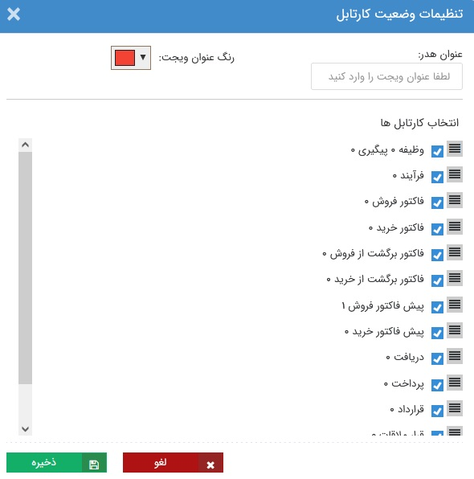

# ویجت وضعیت کارتابل  
ویجت وضعیت کارتابل، نشانگر کارهای موجود در کارتابل شماست. این ویجت در واقع نمایی از [ویجت کارتابل](https://github.com/1stco/PayamGostarDocs/blob/master/Help/home/widget/Cardboard/2.6.0/CartableWidget.md) می‌باشد؛ با این تفاوت که در ویجت وضعیت کارتابل امکان انجام اقدام برای هیچ کدام از آیتم‌‌ها فراهم **نیست**.

به مشابه ویجت کارتابل، عددی که رو به روی هر کارتابل نمایش داده می‌شود نشانگر نسبت تعداد کارهای مشاهده نشده‌‌ای است که امروز (از 12:01 بامداد) وارد آن کارتابل شده (عدد بالایی) به کل کارهایی که در آن کارتابل وجود دارد (عدد پایین) است. 

> نکته: تفاوت ویجت **کارتابل** و **وضعیت کارتابل** در این است که در ویجت وضعیت کارتابل تنها می‌توانید تعداد آیتم‌های موجود در هر قسمت از کارتابل خود را مشاهده کنید، اما در ویجت کارتابل می‌توانید لیست آن‌ها را نیز مشاهده کرده، فیلترهای مختلفی روی آن‌ها اعمال کنید و از همان قسمت به آن‌ها رسیدگی کنید.
>> مشابه ویجت کارتابل، در ویجت وضعیت کارتابل نیز امکان مشاهده آیتم‌هایی که مجوز آن‌ها را ندارید وجود ندارد.

## ویرایش تنظیمات ویجت وضعیت کارتابل
در ویجت وضعیت کارتابل نیز علاوه بر قابلیت تنظیم اندازه، جایگاه، رنگ و عنوان، امکان تنظیم تب‌ها نیز وجود دارد. 
بر این اساس می‌توانید کارتابل‌های مورد نیاز خود را به منظور نمایش در این ویجت انتخاب کنید. در این حالت تنها وضعیت کارتابل‌هایی کخ انتخاب کرده‌اید در ویجت به شما نمایش داده می‌شود. 

به جهت اعمال شدن تغییرات و ویرایش‌های انجام شده در تنظیمات، بر روی **ذخیره** کلیک نمایید. 
