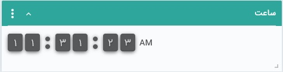
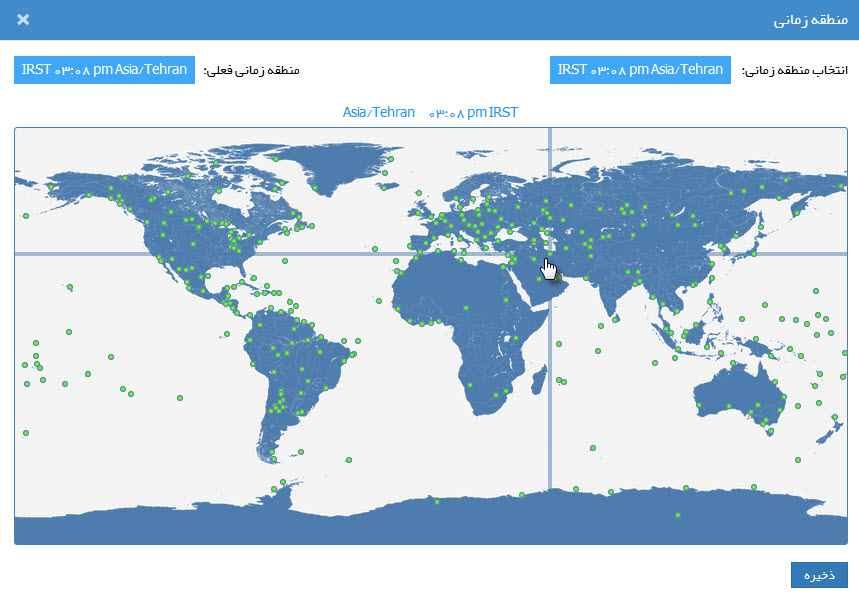

# ویجت ساعت  
با استفاده از ویجت ساعت می‌توانید زمان به وقت مناطق مختلف جغرافیایی را بر روی صفحه داشبورد خود مشاهده نمایید. در نتیجه اگر شما جز افرادی هستید که به مشاهده ساعت به وقت سایر کشورها نیاز دارید، می‌توانید به تعداد نیاز ویجت ساعت به داشبورد خود اضافه کرده و هر یک را بر اساس منطقه مورد نظر خود تنظیم نمایید.

به هنگام اضافه کردن ویجت به صفحه، از شما خواسته می‌شود که منطقه جغرافیایی مورد نظر را انتخاب نمایید.

## ویرایش تنظیمات ویجت ساعت
در ویجت ساعت، علاوه بر قابلیت تنظیم اندازه، جایگاه، رنگ و عنوان که در «[ویجت چیست](https://github.com/1stco/PayamGostarDocs/blob/master/Help/home/widget/Widgets2.7.0.md#WidgetSetting) » توضیح داده شد، امکان تغییر منطقه جغرافیایی که به هنگام اضافه کردن ویجت انتخاب کرده بودید نیز وجود دارد. 

در قسمت سمت راست، منطقه انتخاب شده که ساعت بر اساس آن نمایش داده می‌شود قابل مشاهده است.