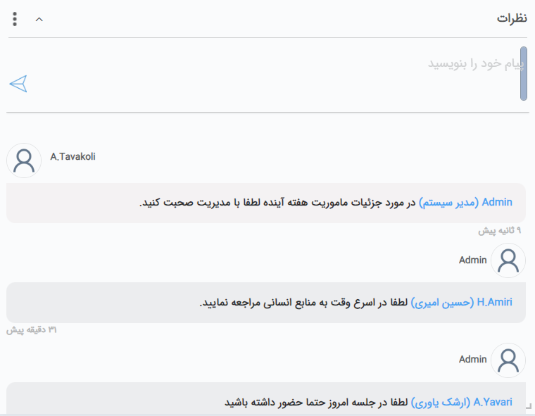
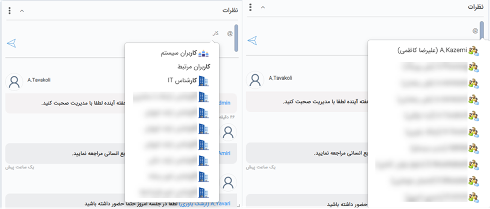
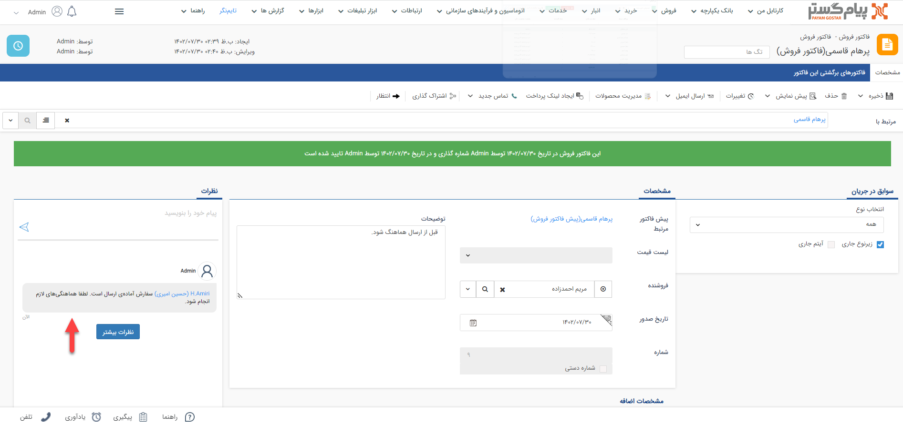
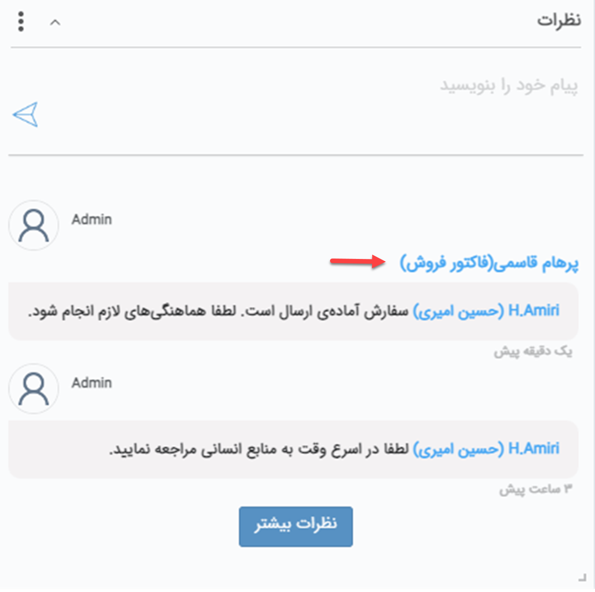
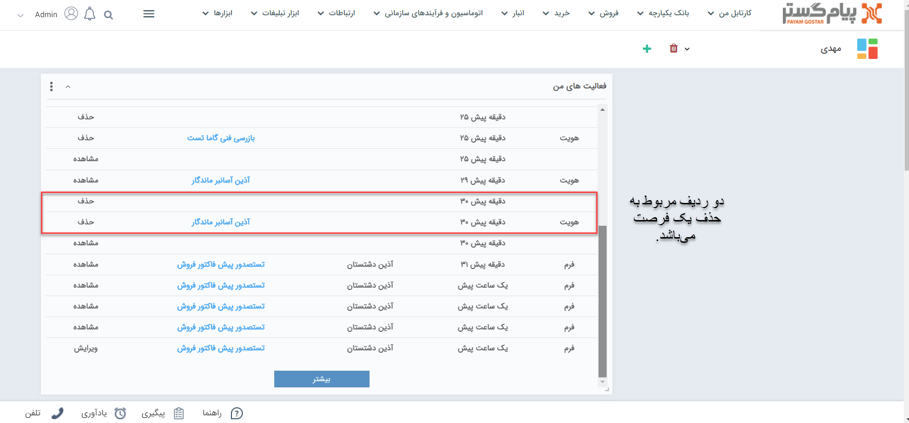
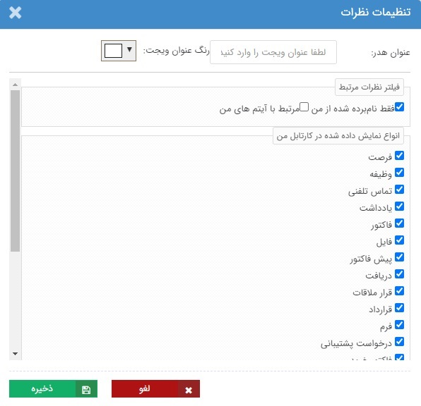

#  ویجت نظرات  
 ویجت نظرات ابزاری برای ارتباط کاربران با یکدیگر است. از این ویجت می‌توانید برای ارسال پیام به یک و یا گروهی از همکاران خود که در نرم‌افزار دارای کاربری هستند، استفاده نمایید. پیام‌هایی که در این مطلب در مورد آن توضیح داده شده، با عنوان **نظر** در نرم‌افزار معرفی می‌شود. 

 

برای ارسال پیام به همکار/همکاران خود، کافیست روی قسمت مربوطه (A) کلیک کرده و علامت"@" را تایپ نمایید. لیستی از کاربران، گروه‌ها و دپارتمان‌ها جهت انتخاب نمایش داده می‌شود. کاربر/کاربرانی مورد نظر (دریافت‌کننده پیام) را انتخاب کرده، پیام خود را نوشته و از آیکون ارسال در سمت چپ (B) برای ارسال استفاده نمایید. برای ارسال پیام از کلیدهای ترکیبی Enter + Ctrl نیز می‌توانید استفاده کنید. 
در صورتی که پیامی از همکاران خود دریافت کرده باشید، در همین ویجت می‌توانید آن را مشاهده نمایید. در تصویر فوق، کاربر ادمین پیامی از کاربری توکلی دریافت کرده است که در بخش C قابل مشاهده است. 
پیام‌هایی که ما پیش‌تر برای همکاران ارسال کرده‌ایم نیز در همین بخش قابل رویت است. در ابتدای پیام گیرنده‌‌ی پیام (D)‌ مشخص شده است. 

چنانچه پیش‌تر به آن اشاره شد، با درج @، لیست اسامی کاربران نرم‌افزار به شما نمایش داده می‌شود. علاوه بر کاربران، شما می‌توانید یک گروه کاربری، سمت و یا دپارتمان را نیز مورد خطاب قرار دهید. در صورتی که نام گروه، سمت یا دپارتمان مورد نظر را در لیست مشاهده نمی‌کنید، کافیست حروف ابتدایی نام آن را بنویسید. لیست گروه‌های کاربری و سمت‌های موجود در سیستم، متناسب با عبارت مندرج به شما نمایش داده می‌شود. آیکون نمایش داده شده در کنار اسامی می‌تواند در فهمیدن نوع آن (کاربر/گروه/سمت/دپارتمان) به شما کمک کند. به عنوان مثال در تصویر فوق از بین کاربران علیرضا کاظمی، از بین گروه‌های کاربری گروه کاربران سیستم و از بین سمت‌ها کارشناس IT قابل مشاهده است. 
انتخاب کاربر مرتبط به هنگام [افزودن نظر در کنار آیتم‌های مختلف CRM](#ItemsComments) (نظیر فاکتور، قرارداد و...) کارربرد دارد. در صورت انتخاب کاربر مرتبط برای ارسال پیام، نظر در ویجت نظرات مسئول آیتم و همچنین ثبت‌کننده‌ی آن نمایش داده می‌شود. منظور از مسئول، کاربر درج شده در بخش «تخصیص داده شده به» در فرصت، قرارداد و درخواست و یا کاربر تعیین شده به عنوان فروشنده در انواع فاکتورها است. این پیام برای ثبت‌کننده‌ی آیتم در بخش [یادآوری‌های سیستم](https://github.com/1stco/PayamGostarDocs/blob/master/Help/home/NotificationManagement2.6.0.md) (زنگوله‌ی بالای صفحه) نیز اعلام می‌شود.  

> **نکته** 
> اگر در ارسال پیام خود از طریق **ویجت نظرات** موجود در داشبورد، از کاربری نام نبرده باشید (کاربری را منشن نکرده باشید)، پیام برای تمامی کاربران ارسال می‌شود و اگر گزینه‌ی «فقط نام‌برده شده از من» در ویجت نظرات کاربر غیرفعال باشد، پیام شما در ویجتش مشاهده می‌کند. 

## ثبت نظر در کنار آیتم{#ItemsComments}  
در تمامی آیتم‌های CRM، بخش نظرات در سمت چپ صفحه قابل مشاهده است. در کنار صفحه پروفایل هویت و تمامی آیتم‌های قابل ثبت برای آن،‌ بخش نظرات **پس از ذخیره** قابل استفاده خواهد بود. در صورتی که نیاز به ذکر مطلب و یا ارسال پیام در خصوص آیتم خاصی دارید می‌توانید از این بخش استفاده نمایید. 

> **نکته** 
> برای اینکه یک کاربر بتواند در کنار آیتم‌های CRM نظر ثبت کند باید مجوز «افزودن نظر» آن آیتم را داشته باشد.  

فرض کنید که می‌خواهید آماده بودن فاکتور یکی از مشتریان برای ارسال را به یکی از همکاران خود اعلام نمایید. کافیست در فاکتور مشتری،‌ از بخش نظرات، کاربر/همکار مورد نظر را انتخاب (منشن) کنید و پیام خود را برای او ارسال نمایید. در تصویر زیر، ادمین برای کاربری حسین امیری پیامی در خصوص فاکتور مشتری ارسال کرده و آماده بودن سفارشات فاکتور شماره ۹ پرهام قاسمی را اطلاع داده است. 

کاربری که در نظر از او نام برده شده است (گیرنده پیام) پیام ارسال شده را در ویجت نظرات خود مشاهده می‌نماید. تصویر زیر ویجت نظرات کاربر گیرنده پیام (در مثال فوق کاربری حسین امیری) را نشان می‌دهد. همان طور که در تصویر مشخص است، در این حالت، لینک دسترسی به آیتمی که نظر بر روی آن ثبت شده، در بالای پیغام به کاربر نمایش داده می‌شود. کاربر با کلیک بر روی آن وارد صفحه فاکتور شماره ۹ پرهام قاسمی خواهد شد. 

> **نکته** 
> نظراتی که در کنار یک آیتم CRM (فاکتور و...) ثبت می‌شود، برای تمام کسانی که مجوز مشاهده آیتم را داشته باشند قابل رویت است. اما پیغام آن صرفا برای کاربری که از او در آن پیام نام برده شده باشد ارسال می‌شود. به عبارتی فقط شخص/اشخاص منشن شده، پیغام آن را بر روی ویجت نظرات داشبور خود مشاهده می‌کنند. البته لازم به ذکر است اگر کاربری، تنظیمات مشاهده نظرات ثبت شده بر روی [**آیتم‌های مرتبط با من**](#ItemRegistrantNotification) را فعال کرده باشد، ثبت‌کننده‌ی آیتم نیز پیام را بر روی ویجت نظرات خود مشاهده خواهد کرد. 
>> در صورتی که کاربر نام برده شده در نظر، مجوز مشاهده‌ی آن آیتم را نداشته باشد، پیام درج شده در نظر، در ویجت نظرات برای او نمایش داده می‌شود؛ اما با کلیک بر روی لینک آیتم (درج شده در بالای پیام) قادر به مشاهده‌ی آن نخواهد بود.

## اعلام نظر جدید در یادآوری‌های سیستم 
در صورتی که در نظری از شما نام برده شده باشد، علاوه بر ویجت نظرات، قسمت [یادآوری‌های سیستم](https://github.com/1stco/PayamGostarDocs/blob/master/Help/home/NotificationManagement2.6.0.md) (آیکون زنگوله قابل مشاهده در بالای صفحه) نیز آن را به شما نمایش می‌دهد. تعداد پیام‌های جدید به صورت عددی بر روی زنگوله به شما اعلام می‌شود. با کلیک بر روی این بخش می‌توانید اطلاعات پیغام رسیده را مشاهده نمایید. 

در صورتی که در نظری در کنار یکی از آیتم‌ها از شما نام برده شده باشد، لینک دسترسی به آیتم با عنوان «مشاهده آیتم» در زیر اطلاعات پیام در دسترس است (مانند ردیف اول در تصویر فوق). در صورتی که نظر از طریق ویجت نظرات روی صفحه داشبورد برای شما ارسال شده باشد صرفا اطلاعات پیام به شما نشان داده می‌شود (مانند ردیف دوم). 

## حذف نظر
در صورتی که مجوز حذف نظر را داشته باشید، به هنگام بردن نشانگر بر روی پیام مورد نظر، آیکون حذف (×) به شما نشان داده می‌شود.

تنها کاربر **ثبت‌کننده نظر**، **مدیرسیستم** (ادمین و هر کاربری که مجوز مدیر سیستم را داشته باشد) و کاربری که مجوز **حذف نظر** را دشته باشد می‌تواند یک نظر را حذف کند. مجوز حذف نظر و مدیر سیستم هر دو در [دسترسی‌های عمومی در بخش عمومی](https://github.com/1stco/PayamGostarDocs/blob/master/Help/Settings/GroupsAndUsersManagement/permissions/GeneralPermission_2.7.0.md#GeneralItemsPermissions) قابل تنظیم است. 

## ویرایش تنظیمات ویجت نظرات
در ویجت نظرات، علاوه بر قابلیت تنظیم اندازه، جایگاه، رنگ و عنوان که در «[ویجت چیست](https://github.com/1stco/PayamGostarDocs/blob/master/Help/home/widget/Widgets2.7.0.md#WidgetSetting) » توضیح داده شد، امکان تغییر نظرات نمایش داده شده نیز وجود دارد. 

- **فقط نام برده شده از من:** برای اینکه نظرهایی که در آن از شما نام برده شده (منشن شده‌اید) در ویجت نظرات برایتان نمایش داده شود، این گزینه باید فعال باشد. 

- **مرتبط با آیتم‌های من:**{#ItemRegistrantNotification} با فعال کردن این گزینه، تمامی نظرات مندرج روی آیتم‌های ثبت شده توسط کاربری شما، حتی اگر در آن از شما نام برده نشده باشد، به شما نمایش داده می‌شود.  
فرض کنید شما فاکتوری برای یکی از مشتریان خود ثبت کرده‌اید. یکی از همکاران شما بر روی آن فاکتور نظری ثبت می‌کند و یکی دیگر از همکاران را منشن می‌کند. با وجود اینکه شما در آن نظر منشن نشده‌اید، پیام در ویجت نظرات برای شما نیز نمایش داده می‌شود چراکه ثبت‌کننده فاکتور بوده‌اید. 

- **انواع نمایش داده شده در کارتابل من:** در این قسمت می‌توانید انتخاب کنید، نظرات ثبت شده در کنار کدام آیتم‌ها به شما نمایش داده شود. تنظیمات اعمال شده در قسمت بالا بر روی موارد انتخابی در این قسمت اعمال می‌گردد. به طور مثال اگر گزینه هر دو گزینه‌ی فیلتر نظرات مرتبط فعال بوده و در این قسمت فقط فرصت را فعال نمایید، تمامی نظرات درج شده بر روی فرصت‌هایی که شما ثبت‌کرده‌اید و همچنین نظرات مندرج در کنار فرصت‌ها که از شما در آن‌ها نام برده شده است در ویجت نظرات به شما نمایش داده می‌شود. نظرات مندرج در کنار سایر آیتم‌ها در این ویجت قابل نمایش نخواهد بود. 

> **نکته** 
> این تنظیمات صرفا برای **ویجت نظرات** اعمال خواهد شد. 
>> حتی در صورت غیرفعال کردن گزینه «فقط نام‌برده شده از من»، اعلام نظر جدید در بخش یادآوری‌های سیستم (زنگوله‌ی بالای صفحه) انجام خواهد شد. 
>> با وجود فعال بودن گزینه‌ی «مرتبط با آیتم‌های من»، این نظرات صرفا در ویجت قابل مشاهده بوده و در بخش یادآوری‌های سیستم اعلام نخواهد شد. 

