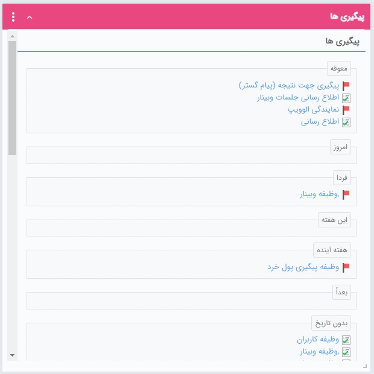

# ویجت پیگیری‌ها 

در این ویجت لیست کلیه [پیگیری‌هایی](https://github.com/1stco/PayamGostarDocs/blob/master/Help/Integrated-bank/Database/General-specifications/Reminder-and-follow-up/Reminder-and-follow-up.md) که برای خود ثبت کرده‌اید  تمامی و [وظایفی](https://github.com/1stco/PayamGostarDocs/blob/master/Help/Integrated-bank/Database/Records/New-task/New-task.md) که مسئول انجام آن هستید (به شما ارجاع داده شده) را می‌توانید مشاهده نمایید. بدین ترتیب می‌توانید کارهایی که باید انجام آن را به خاطر داشته باشید در یک کادر ببینید. 
لازم به ذکر است که این ویجت نمایی دیگر از بخش [پیگیری‌ها در نوار دسترسی](https://github.com/1stco/PayamGostarDocs/blob/master/Help/home/Storytelling/Followup/followUpInAccessBar.md) است و در واقع لیستی از پیگیری‌ها و وظایفی را به شما نشان می‌دهد. شما می‌توانید از طریق کارتابل وظیفه، پیگیری نیز به آن‌ها دسترسی داشته باشید. 

> **نکته** 
> در این ویجت، پیگیری‌ها با آیکون پرچم قرمز رنگ و وظایف با آیکون یادداشت سبزرنگ نمایش داده می‌شوند. 

نحوه قرارگیری وظایف و پیگیری‌ها در هر کدام از بازه‌های زمانی این ویجت (معوقه، امروز، فردا و ....) بر اساس تاریخ وارد شده در قسمت موعد پیگیری و مهلت وظیفه می‌باشد. یعنی: 
- پیگیری‌ها بر اساس تاریخ «موعد» در گروه‌‌های مختلف زمان‌بندی قرار می‌گیرند.
- در مورد آیتم وظیفه چنانچه به هنگام ارجاع وظیفه به شما، برای آن تاریخ «مهلت» انتخاب شده باشد، جایگاه آن در لیست پیگیری‌ها بر اساس آن تعیین می‌شود. در غیر این صورت (یعنی ارجاع بدون تاریخ مهلت)‌وظیفه در قسمت «بدون تاریخ» نمایش داده می‌شود.

