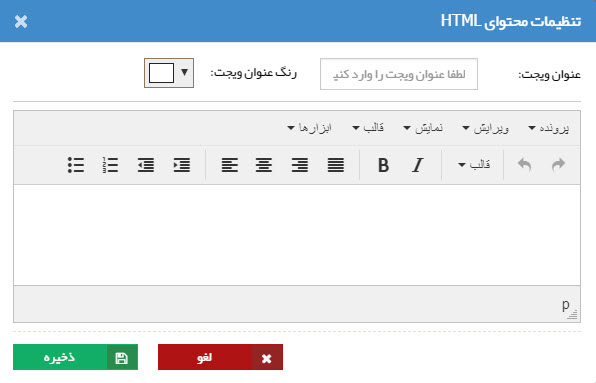
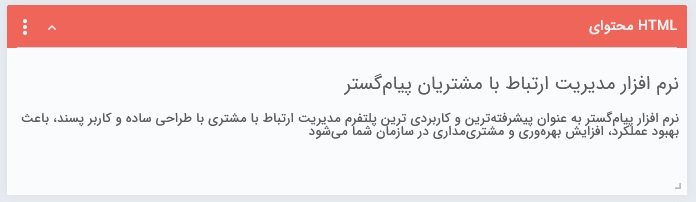

# ویجت محتوای HTML 

با استفاده از این ویجت می‌توانید محتواهای پرکاربرد خود را در قالب  یک محتوای HTML بر روی صفحه‌ی داشبوردتان داشته باشید. برای این کار کافیست متن مورد نظر را در کادر مربوطه نوشته و در صورت نیاز با استفاده از ابزارهای موجود، نحوه‌ی نمایش آن را تنظیم نمایید. 

پس از ذخیره، محتوای ثبت شما به شکل تصویر پایین به شما نمایش داده می‌شود. 

