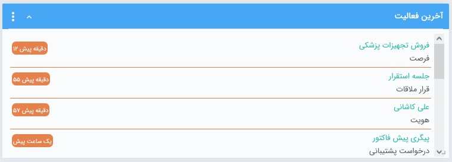
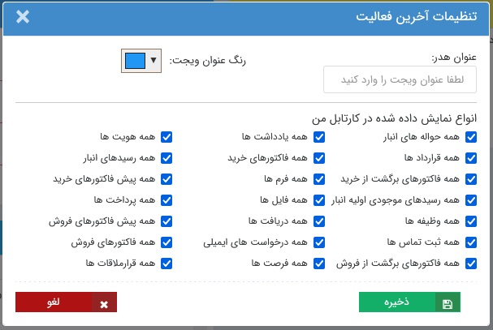

# ویجت آخرین فعالیت   

در این ویجت آخرین فعالیت‌های کاربری شما شامل **ایجاد** و **ویرایش** آیتم و همچنین فعالیت ویرایش سایر کاربران بر روی **آیتمی که شما ثبت‌کننده آن بودید** به شما نمایش داده می‌شود. فرض کنید شما فاکتوری برای یکی از مشتریان خود در سیستم ثبت کرده‌اید. از آن به بعد، هرگونه ویرایشی توسط هر کدام از کاربرها بر روی آن فاکتور انجام بگیرد،‌ در این ویجت به شما نمایش داده می‌شود. از این طریق می‌توانید بر روی تغییرات اعمال شده بر آیتم‌هایی که ثبت کرده‌اید نظارت مستمر داشته باشید. 

> **نکته** 
 برخلاف ویجت فعالیت‌های من، مشاهده‌ و حذف آیتم در این ویجت قابل رویت نیست. 

## ویرایش تنظیمات ویجت آخرین فعالیت 

در ویجت نظرات، علاوه بر قابلیت تنظیم اندازه، جایگاه، رنگ و عنوان که در «[ویجت چیست](https://github.com/1stco/PayamGostarDocs/blob/master/Help/home/widget/Widgets2.7.0.md#WidgetSetting) » توضیح داده شد، امکان انتخاب آیتم‌های مورد نظر برای نمایش فعالیت‌های آن‌ها نیز وجود دارد. 

در این قسمت می‌توانید انتخاب نمایید فعالیت‌های مذکور، در مورد کدام آیتم‌ها به شما نمایش داده شود. آیتم‌هایی که در این قسمت مشخص شده‌اند، آیتم‌هایی هستند که ایجاد و یا ویرایش آن‌ها در ویجت آخرین فعالیت به شما نمایش داده می‌شود. به عنوان مثال در صورتی که مایل هستید فقط فعالیت‌های انجام گرفته در خصوص فاکتورهای فروش را مشاهده نمایید، می‌توانید تمامی آیتم‌ها به جز فاکتور فروش را غیرفعال نمایید.

