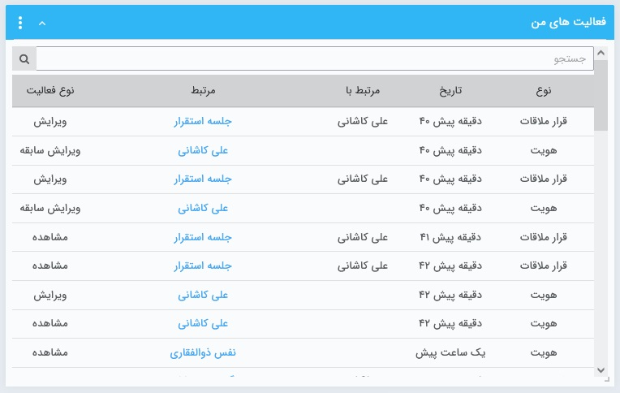

# ویجت فعالیت‌های من  

آخرین فعالیت‌های خود در نرم‌افزار را می‌توانید در این ویجت مشاهده نمایید. به عبارتی **ایجاد**، **مشاهده**، **ویرایش** و **حذف** هر آیتم که توسط کاربری شما انجام شده باشد، در این ویجت به شما نمایش داده می‌شود. 
 در ستون **مرتبط**، آیتمی که فعالیت ایجاد/حذف/ویرایش/مشاده در آن انجام شده است نمایش داده می‌شود. عبارت درج شده قابل کلیک بوده و با کلیک بر روی آن می‌توانید به آن آیتم دسترسی داشته باشید. در صورتی که فعالیت انجام گرفته،‌ در مورد یکی از آیتم‌های CRM باشد،‌ نام «مرتبط با» و «زیرنوع موجودیت» در این قسمت نمایش داده می‌شود؛ به عنوان مثال «علی رمضانی(پیش‌فاکتور فروش)». در صورتی که فعالیت بر روی صفحه هویت انجام گرفته باشد نام هویت در این قسمت درج می‌شود. 

ترتیب فعالیت‌های نمایش داده شده در این جدول از جدیدترین فعالیت (سطرهای ابتدایی) تا قدیمی‌ترین فعالیت‌ها (سطرهای انتهایی) است. 
با استفاده از قسمت جستجو نیز می‌توانید به راحتی به فعالیت مورد نظر خود دسترسی داشته باشید.