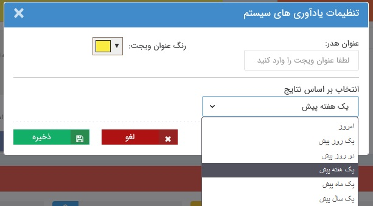

# ویجت یادآورهای سیستم  

این ویجت نمایشی از بخش [یادآوری‌های سیستم](https://github.com/1stco/PayamGostarDocs/blob/master/Help/home/NotificationManagement2.6.0.md) است که با آیکون زنگوله در بالای صفحه قابل مشاهده است. در این ویجت تمامی فعالیت‌هایی که برای آن‌ها پیام سیستمی تنظیم شده باشد، به شما اطلاع داده می‌شود. به صورت پیش‌فرض برای مواردی از قبیل دریافت نظر، تایید/رد آیتم مالی و اعلام وضعیت حضور در قرارملاقات پیام‌ سیستمی در نظر گرفته شده و رخداد این موارد از طریق یک پیام به کاربر مربوطه اطلاع داده می‌شود.

> **نکته** 
> برای کسب اطلاعات بیشتر در خصوص نحوه تنظیم و ویرایش پیام‌های سیستم، به قسمت [مدیریت پیام های سیستم](https://github.com/1stco/PayamGostarDocs/blob/master/Help/Basic-Information/Manage-system-messages/Manage-system-messages.md)  مراجعه نمایید. 

## ویرایش تنظیمات ویجت یادآوری‌های سیستم
در ویجت ساعت، علاوه بر قابلیت تنظیم اندازه، جایگاه، رنگ و عنوان که در «[ویجت چیست](https://github.com/1stco/PayamGostarDocs/blob/master/Help/home/widget/Widgets2.7.0.md#WidgetSetting) » توضیح داده شد، امکان تغییر بازه‌ی زمانی در نظر گرفته شده برای نمایش پیام‌‌های سیستم را تنظیم نمایید. به عنوان مثال با انتخاب گزینه‌ی امروز در این تنظیمات،‌صرفا پیام‌های سیتمی‌ای که در همان روز به شما رسیده است در این ویجت نمایش داده می‌شود. در این حالت برای دیدن پیام‌های قدیمی‌تر باید به بخش [یادآوری‌های سیستم](https://github.com/1stco/PayamGostarDocs/blob/master/Help/home/NotificationManagement2.6.0.md) در بالای صفحه مراجعه نمایید. 

