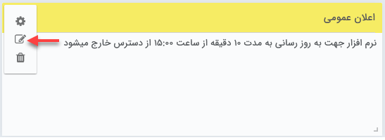

# انتشار پیام در ویجت اعلان عمومی

برای انتشار اخبار و یا در دسترس قرار دادن انواع اطلاعات برای کاربران از طریق ویجت اعلان عمومی به شیوه‌ی زیر اقدام نمایید: 
1. ویجت اعلان عمومی را در داشبورد خود باز کرده و بر روی آیکون ویرایش کلیک کنید.
2. 

> **نکته** 
> برای انتظار پیام در این ویجت و یا ویرایش مطالب موجود باید مجوز «مدیر سیستم» و یا «ویرایش پیام صفحه اول» را داشته باشید.

متن و لینک