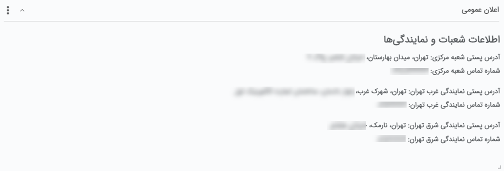

#  ویجت اعلان عمومی  

از این ویجت برای انواع اطلاع‌رسانی و انتشار اطلاعات در بین کاربران استفاده می‌شود. در لیست زیر به نمونه‌هایی از کاربردهای این ویجت اشاره شده است: 
- در اختیار گذاشتن اطلاعاتی مثل کد پستی، آدرس و یا شماره تماس شعبات سازمان برای پرسنل
- اطلاع‌رسانی اخبار، مراسمات و یا تغییرات سازمان
- ایجاد دسترسی به دستورالعمل‌های سازمان
برای استفاده از این ویجت کافیست آن را بر روی داشبورد خود اضافه کنید. اطلاعاتی که پیش‌تر توسط مدیر سیستم در این صفحه قرار داده شده باشد به شما نمایش داده می‌شود 

> **نکته** 
> شما به عنوان کاربر سیستم صرفا قادر به مشاهده مطالب منتشر شده در این ویجت هستید. تنها مدیر سیستم و کاربری که مجوز «ویرایش پیام صفحه اول» را داشته باشند قادر به انتظار و یا ویرایش پیام خواهند بود. 

ممکن از در این ویجت لینک فایل‌های کاربردی در اختیار شما قرار داده شده باشد. در این صورت کافیست بر روی لینک موجود کلیلک نمایید تا به فایل مذکور هدایت شوید. 