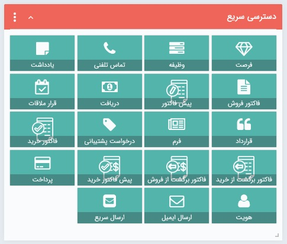
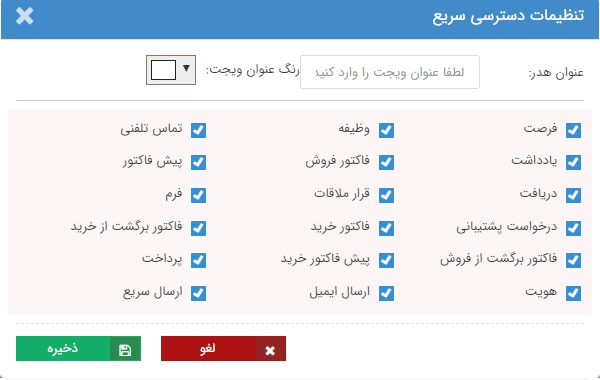

# ویجت دسترسی سریع 
 
با استفاده از این ویجت می‌توانید به راحتی اقدام به ثبت هویت و انواع آیتم‌های جدید کنید. برای ثبت هویت و آیتم‌ها/سوابق مرتبط با آن‌ها مسیرهای مختلفی در نرم‌افزار وجود دارد. این ویجت کوتاه‌ترین مسیر برای ثبت انواع آیتم به شمار می‌آید. 

> **نکته** 
> در این قسمت تنها آیتم‌هایی که مجوز ثبت (مجوز ذخیره اولیه) آن‌ها را دارید برای شما نمایش داده می‌شود. در نتیجه بنا بر دسترسی‌های تعیین شده برای هر کاربر می‌تواند متفاوت باشد.

در ثبت آیتم از طریق ویجت دسترسی سریع به موارد زیر توجه داشته باشید: 
- به هنگام ثبت هویت از مسیر بانک اطلاعاتی، بخش «زمینه فعالیت» به صورت خودکار با مسیری که شما برای ثبت هویت انتخاب کرده‌اید پر می‌شود. اما در صورت استفاده از این ویجت برای ثبت هویت باید گروه مورد نظر خود برای ذخیره هویت را از بین گروه‌های بانک اطلاعاتی انتخاب نمایید. 
- به هنگام ثبت انواع آیتم‌‌ها (فاکتور،‌یادداشت و...) از طریق صفحه پروفایل هویت،‌ بخش «مرتبط با» به صورت خودکار با نام هویت مورد نظر پر می‌شود. اما در صورت استفاده از ین ویجت برای ثبت آیتم، شما باید هویت مورد نظر را انتخاب نمایید. 

## ویرایش تنظیمات ویجت دسترسی سریع 
در ویجت دسترسی سریع، علاوه بر قابلیت تنظیم اندازه، جایگاه، رنگ و عنوان که در «[ویجت چیست](https://github.com/1stco/PayamGostarDocs/blob/master/Help/home/widget/Widgets2.7.0.md#WidgetSetting) » توضیح داده شد، امکان تعیین موجودیت‌های نمایش داده شده نیز وجود دارد. در این بخش می‌توانید از بین **آیتم‌هایی که مجوز ذخیره اولیه آن‌ها را دارید**،‌ آیتم‌های مورد نظر خود را برای نمایش در ویجت دسترسی سریع انتخاب نمایید. 

