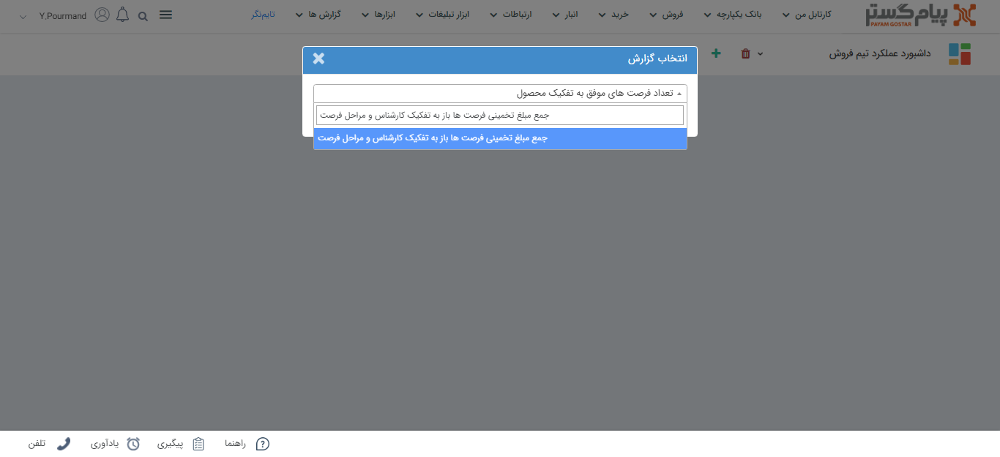
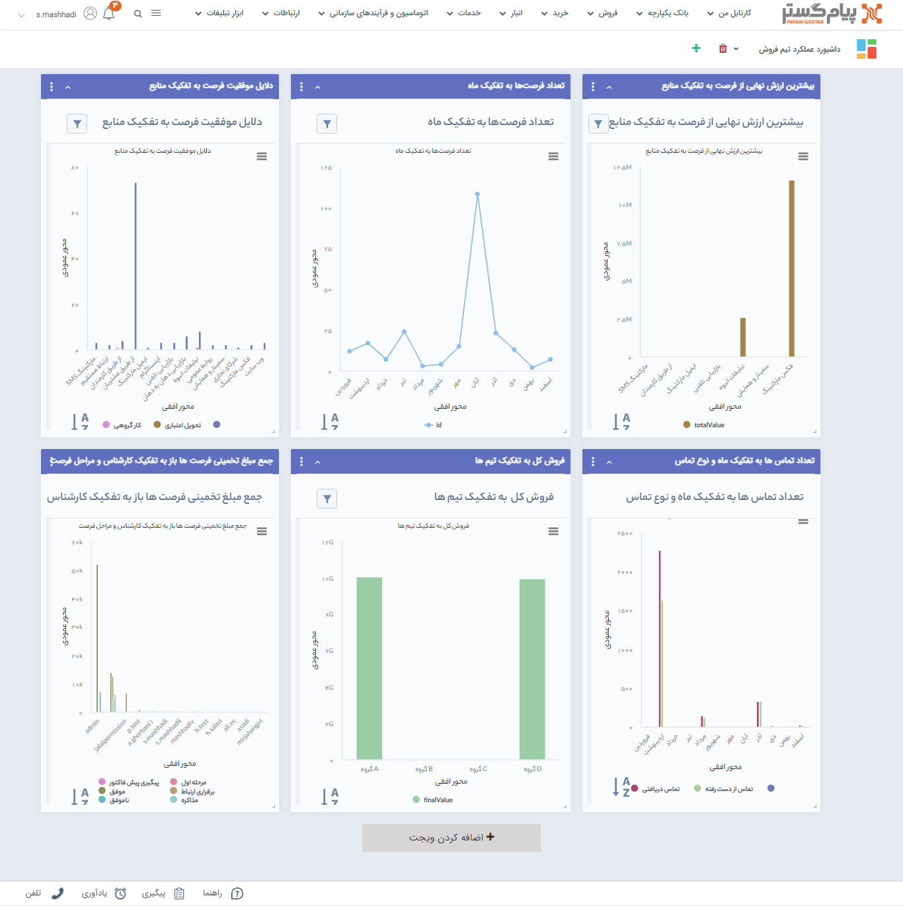
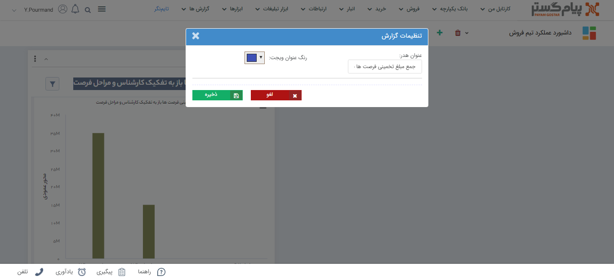

# ویجت گزارش
در این بخش به موارد زیر می‌پردازیم:
- [مزیت استفاده از ویجت گزارش](#ImportanceOfReportWidget)
- [نحوه اضافه کردن ویجت گزارش، به صفحه داشبورد](#AddReportWidget)
- [ویرایش تنظیمات ویجت گزارش](#EditReportWidget)
- [حذف ویجت از روی صفحه داشبورد](#deleteReportWidget)

### مزیت استفاده از ویجت گزارش {#ImportanceOfReportWidget}
به کمک این ویجت می‌توانید یک گزارش به صفحه داشبورد خود اضافه کنید. در ادامه اهمیت این موضوع را با یک مثال شرح می‌دهیم.  
*به عنوان مثال* 
مدیر فروش مسئولیت‌ بررسی عملکرد کارشناسان فروش، وضعیت فرصت‌های فروش، تعداد و زمان تماس‌ها، تعداد پیگیری‌ها و از این دست گزارش‌ها را دارد. بنابراین روزانه نیاز دارد به بخش گزارش‌ها رفته و نتایج را در گزارش‌های مجزا و یا یک داشبورد از ترکیت چند گزارش، را ببیند. در اینجا استفاده از ویجت گزارش در داشبورد، سبب صرفه‌جویی در زمان مدیر فروش خواهد شد. 
 برای سهولت دسترسی به گزارش‌ها ویجتی با نام **گزارش** در اختیار شما قرار داده شده که گزارش‌های مورد نظر خود را به صفحه اصلی نرم‌افزار اضافه کنید.  
به کمک قابلیت  [**چند داشبورد**](https://github.com/1stco/PayamGostarDocs/blob/master/Help/home/MultiDashboard.md)، می‌توانید در صفحه اصلی  براساس تنوع گزارش‌های خود، داشبوردهای مجزا ایجاد کنید.

### افزودن ویجت گزارش به صفحه داشبورد {#AddReportWidget}
1. در صفحه اصلی داشبورد، روی دکمه **اضافه کردن ویجت** کلیک نمایید.
2. از لیست ویجت‌ها، ویجت **گزارش** را انتخاب نمایید.
3. نام گزارش مورد نظر خود را در کادر مربوطه جستجو کنید. علاوه بر آن می‌توانید از لیست گزارش‌هایی که در ویجت به شما پیشنهاد می‌شود، گزارش خود را انتخاب نمایید.

4. پس از انتخاب گزارش مورد نظر خود، روی دکمه **اضافه کردن** کلیک کنید. در این لحظه شما یکی از گزارش‌های پرکاربرد خود را به صفحه داشبورد اضافه کرده‌اید. گفتنی‌ است شما هیچ محدودتی برای اضافه کردن ویجت گزارش به صفحه داشبورد ندارید.

گزارش‌ها را راستای هدفی که از داشبورد خود دارید، انتخاب کنید. مثلا برای ساخت داشبورد عملکرد فروش، از بین گزارش‌های عملکردی فروش، در گزارش‌های پرکاربرد استفاده کنید. 

> **نکته** 
> در ویجت گزارش، تنها استفاده از **گزارش‌های پرکاربرد** امکان پذیر است. یعنی نمی‌توانید از گزارش‌های سیستمی و گزارش‌های که خودتان ساخته‌اید، در این ویجت استفاده کنید.

### ویرایش تنظیمات ویجت گزارش {#EditReportWidget}
همانطور که می‌دانید امکان تغییر نام و رنگ ویجت‌ها وجود دارد. بنابراین با کلیک بر **سه نقطه** بالای ویجت، می‌توانید به گونه‌ی دلخواه خود آن را تنظیم کنید.

### حذف ویجت گزارش {#deleteReportWidget}
درصورتی که ویجت اضافه شده را نیازی ندارید، می‌توانید آن را از صفحه داشبورد خود حذف کنید. برای حذف ویجت به روش زیر عمل کنید:
1. روی علامت **سه نقطه** در کادر بالای ویجت کلیک کنید.
2. روی گزینه **سطل زباله** کلیک کنید.
3. ویجت مورد نظر شما از روی صفحه داشبورد حذف شد.

