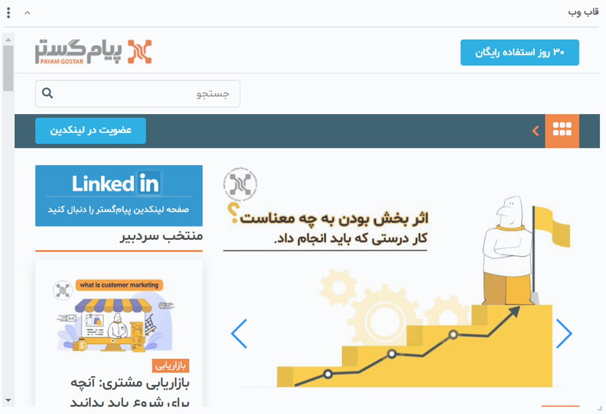
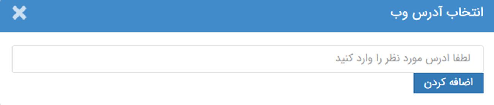
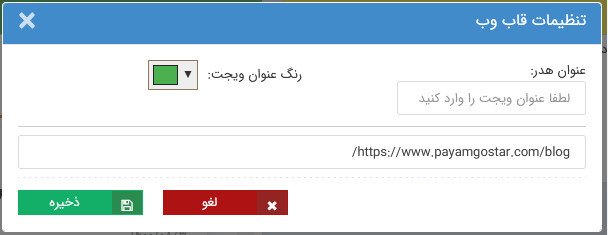

# ویجت قاب وب  
 
با استفاده از این ویجت می‌توانید یک صفحه وب را بر روی داشبورد خود به نمایش بگذارید. به عنوان مثال در صورت نیاز هر روزه به یک سایت آماری، می‌توانید با استفاده از این ویجت به آسان‌ترین روش به آن دسترسی مداوم داشته باشید. 

 صفحه‌ی وب نماش داده شده در این ویجت قابل کلیلک بوده و شما می‌توانید از طریق همین قاب به بخش‌های مختلف سایت دسترسی داشته باشید. 

## تنظیم آدرس وب در ویجت قاب وب

زمان اضافه کردن ویجت قاب وب به صفحه، از شما خواسته می‌شود آدرس سایت مورد نظر را تعیین نمایید. 

 آدرس URL وب سایت مورد نظر را در کادر مربوطه وارد نموده و ویجت را به صفحه اضافه نمایید. 
در صورتی که این ویجت را پیش‌تر به صفحه اضافه نموده‌اید و قصد ویرایش آدرس URL تعریف شده را دارید، بر روی سه نقطه موجود در بالای ویجت و آیکون تنظیمات کلیک کنید. از این طریق می‌توانید آدرس را ویرایش و مجدد ذخیره نمایید.  

> **نکته** 
> توجه داشته باشید که آدرس را با https:// و یا http:// آن به صورتکامل وارد نمایید.
