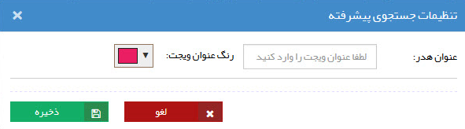

# ویجت چیست؟

ویجت‌ها ابزاری برای **دسترسی آسان و سریع** به بخش‌های پرکاربرد نرم‌افزار هستند. به صورت کلی، برخی از  ویجت‌ها مسیر میان‌بر دسترسی به بخش‌های پرکاربرد نرم‌افزار را مهیا می‌کنند و برخی دیگر وسیله دسترسی به اطلاعات عمومی هستند. 
شما با توجه به نیاز خود می‌توانید ویجت‌های پرکاربرد خود را به داشبوردهای مختلف اضافه نموده و حتی عنوان، رنگ، اندازه و جایگاه مورد نظر خود را برای هر ویجت انتخاب کنید. این یعنی شما می‌توانید ویجت‌ها را متناسب با نیاز خود تنظیم کنید. زمانی که برای اولین بار به نرم‌افزار وارد می‌شوید ویجت‌هایی به صورت پیش‌فرض روی صفحه وجود دارد. هرکدام از آن‌ها را که نیاز ندارید می‌توانید حذف نمایید و ویجت مورد نیاز خود را به صفحه اضافه کنید.  
آنچه در این مطلب به آن پرداخته شده است: 
- [انواع ویجت‌های موجود در پیام‌گستر](#Widgets)
- [نحوه افزودن ویجت به داشبورد](#AddNewWidget)
- [نحوه ویرایش تنظیمات ویجت‌ها](#WidgetSetting)
- [نحوه حذف ویجت از داشبورد](#DeleteWidget)
## انواع ویجت‌ها{#Widgets}
شما می‌توانید از ۱۸ نوع ویجت موجود در نرم‌افزار پیام‌گستر جهت سهولت کار خود استفاده نمایید. ویجت‌های موجود شامل عنوان زیر می‌باشد: 
1. [ویجت گزارش](https://github.com/1stco/PayamGostarDocs/blob/master/Help/home/widget/ReportWidget.md)
2. [ویجت جستجوی پیشرفته](https://github.com/1stco/PayamGostarDocs/blob/master/Help/home/widget/AdvancedSearch/AdvancedSearchWidget.md)
3. [ویجت کارتابل](https://github.com/1stco/PayamGostarDocs/tree/master/Help/home/widget/Cardboard/Cardboard.md)
4. [ویجت وضعیت کارتابل](https://github.com/1stco/PayamGostarDocs/blob/master/Help/home/widget/CartableStatus/CartableStatusWidget.md)
5. [ویجت دسترسی سریع](https://github.com/1stco/PayamGostarDocs/blob/master/Help/home/widget/QuickAccess/QuickAccessWidget.md)
6. [ویجت قرارملاقات](https://github.com/1stco/PayamGostarDocs/blob/master/Help/home/widget/AppointmentWidget/AppointmentWidget.md)
7. [ویجت تماس‌های دریافتی](https://github.com/1stco/PayamGostarDocs/blob/master/Help/home/widget/ReceivedCalls/ReceivedCalls-2.7.5.md)
8. [ویجت آخرین تماس‌ها](https://github.com/1stco/PayamGostarDocs/blob/master/Help/home/widget/RecentCalls/RecentCallsWidget.md)
9. [ویجت اعلان عمومی](https://github.com/1stco/PayamGostarDocs/blob/master/Help/home/widget/PublicAnnouncement/PublicAnnouncementWidget.md)
10. [ویجت قاب وب](https://github.com/1stco/PayamGostarDocs/blob/master/Help/home/widget/WebFrame/WebFrameWidget.md)
11. [ویجت نظرات](https://github.com/1stco/PayamGostarDocs/tree/master/Help/home/widget/Comments/Comments.md)
12. [ویجت فعالیت‌های من](https://github.com/1stco/PayamGostarDocs/blob/master/Help/home/widget/MyActivities/MyActivitiesWidget.md)
13. [ویجت آخرین فعالیت‌ها](https://github.com/1stco/PayamGostarDocs/blob/master/Help/home/widget/LastActivitiy/LastActivityWidget.md)
14. [ویجت ساعت](https://github.com/1stco/PayamGostarDocs/blob/master/Help/home/widget/Clock/ClockWidget.md)
15. [ویجت تقویم](https://github.com/1stco/PayamGostarDocs/blob/master/Help/home/widget/Calendar/CalendarWidget.md)
16. [ویجت پیگیری‌ها](https://github.com/1stco/PayamGostarDocs/blob/master/Help/home/widget/FollowUpWidget/FollowUpWidget.md)
17. [ویجت یادآوری‌های سیستم](https://github.com/1stco/PayamGostarDocs/blob/master/Help/home/widget/NotificationManagementWidget/NotificationManagementWidget.md)
18. [ویجت محتوای HTML](https://github.com/1stco/PayamGostarDocs/blob/master/Help/home/widget/HtmlContent/HtmlContentWidget.md)

در مورد هر یک از این ویجت‌ها، توضیحات کامل در بخش معرفی ویجت‌ها ارائه شده است. برای مشاهده راهنمای مربوطه بر روی نام ویجت در لیست بالا کلیک کنید. 
## افزودن ویجت به داشبورد
{#AddNewWidget}
برای اضافه کردن ویجت مورد نظر کافی است بر روی **«اضافه کردن ویجت»**، که در پایین صفحه داشبورد قابل مشاهده است، کلیک کنید. 

از بین موارد موجود در صفحه جدید، ویجت مورد نظر خود را جهت افزودن به صفحه انتخاب نمایید. 

## ویرایش تنظیمات ویجت
{#WidgetSetting}
ویجت‌ها با داشتن قابلیت شخصی‌سازی، این امکان را به شما می‌دهند که اندازه و جایگاهشان در هر داشبورد را بر حسب نیاز خود تغییر دهید. 

علاوه بر آن با استفاده از سه نقطه بالای هر ویجت (قابل مشاده در قسمت سمت چپ نوار بالای هر ویجت) و انتخاب **گزینه چرخ‌دنده** (آیکون A در تصویر) می توانید تنظیمات  آن را تغییر دهید. شما می‌توانید رنگ و عنوان هر ویجت را به دلخواه خود تعیین نمایید. در برخی از ویجت‌ها سایر تنظیمات نیز قابل تغییر می‌باشد که در توضیحات هر ویجت به آن‌ها اشاره شده است. 

## حذف ویجت
{#DeleteWidget}
درصورتی که به ویجت اضافه شده نیاز ندارید، می‌توانید آن را از صفحه داشبورد خود حذف کنید. برای حذف ویجت کافی است روی سه نقطه بالای ویجت مورد نظر کلیک کنید و سپس با انتخاب گزینه **سطل زباله** (آیکون B در تصویر) اقدام به حذف آن نمایید. 