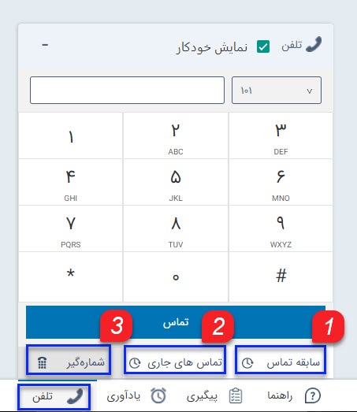
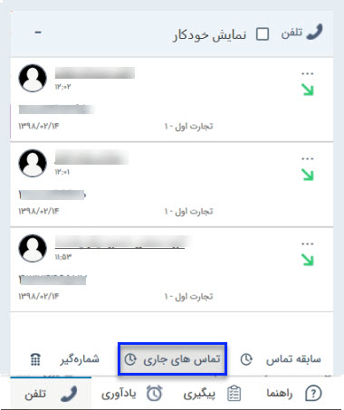
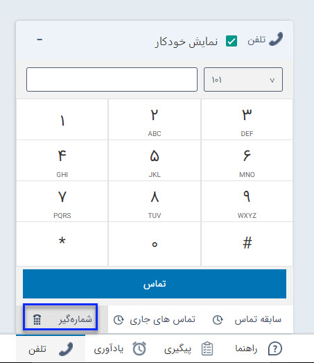

# تلفن

**تلفن:**

با استفاده از این نوار ابزار می توانید لیست تماس های دریافتی را مشاهده کنید (تماس های جاری و سابقه تماس های دریافت شده). همچنین با استفاده از شماره گیر می توانید با شماره مدنظر خود تماس بگیرید. 

**1\. سابقه تماس:** می توانید لیست سوابق تماس های دریافتی را از این قسمت مشاهده کنید.

برای اطلاع از تنظیمات مربوط به تعداد تماس ها، به [تنظیمات من](../../MySetting.md)  مراجعه کنید.

**2\. تماس های جاری:** می توانید لیست تماس های دریافتی جاری را از این قسمت مشاهده کنید.

**3\. شماره گیر:** با استفاده از شماره گیر می توانید مستقیما از نرم افزار با شماره مدنظر خود تماس بگیرید.

نکته: این قابلیت فقط در سیستم های وویپ قابل استفاده است.

