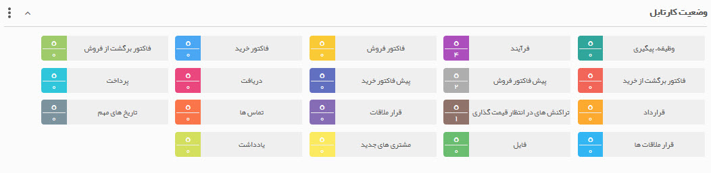
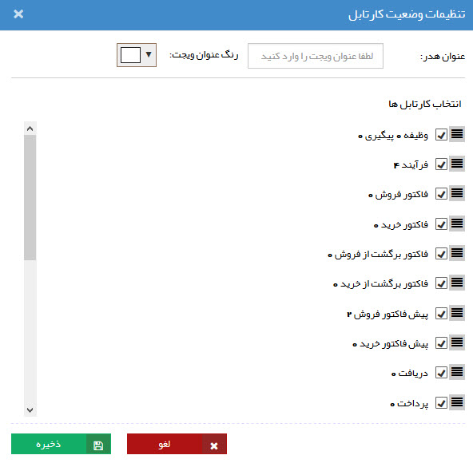

# وضعیت کارتابل    

**وضعیت کارتابل** 

وضعیت کنونی کارتابل شما را نمایش می دهد.

 

نکته: تفاوت ویجت کارتابل و وضعیت کارتابل در این است که در ویجت وضعیت کارتابل تنها می توانید تعداد آیتم های موجود در هر قسمت از کارتابل خود را مشاهده کنید، اما در ویجت کارتابل می توانید لیست آن ها را نیز مشاهده کرده و فیلترهای مختلفی روی آن ها اعمال کنید

با استفاده از قسمت تنظیمات این ویجت میتوانید کارتابلهای دلخواه را به نمایش بگذارید.

