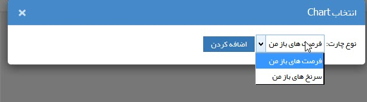
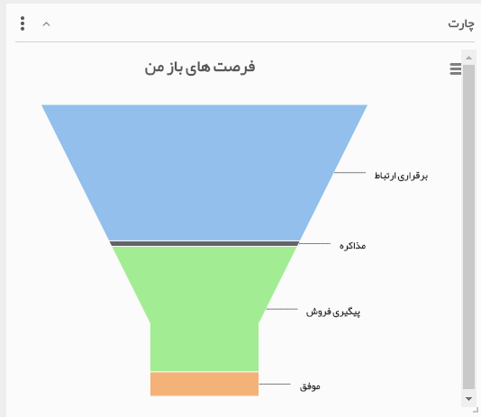

# چارت    

**چارت** 

با استفاده از این ویجت، کارشناسان فروش می توانند چارت [فرصت فروش های](../../PayamGostarSyncBank/JobsForFirst/Background/NewOpportunity.md) باز که باید پیگیری کنند را به تفکیک مرحله ی آنها مشاهده کنند و یا لیست سرنخ هایی که نیاز به پیگیری دارند را مشاهده کنند.

 

برای مثال لیست فرصت های باز به شکل زیر نمایش داده می شود. توجه داشته باشیدکه این فرصت ها باید پیگیری کننده (فیلد تخصیص داده شده به) مشخص داشته باشند تا در این چارت نمایش داده شوند.

 

نکته : فرصت های باز به فرصت هایی گفته می شود که تاریخ بسته شدن آن ها نرسیده باشد.

نکته : سرنخ های باز به سرنخ هایی گفته می شود که وضعیت سرنخ در آن ها "نامعلوم" باشد.