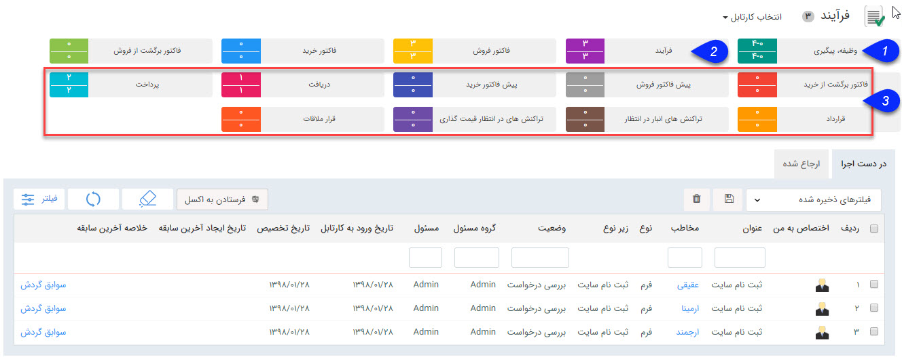
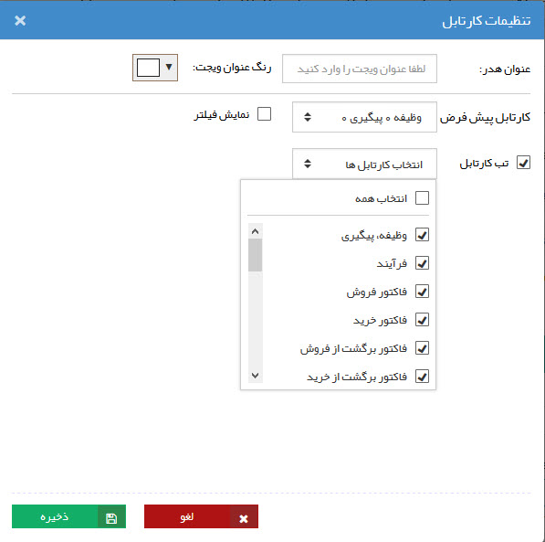

# کارتابل    

**کارتابل من**

در این قسمت کارهای ارجاع شده به کاربر در دسته بندی های ذیل نمایش داده می شوند.

نکته: عددی که روبروی هر کارتابل نمایش داده می شود، نشانگر تعداد کارهایی که امروز (از 12:01 بامداد) وارد آن کارتابل شده اند(عدد بالایی)، نسبت به کل کارهایی است که در آن کارتابل وجود دارد(عدد پایین).

تب های مختلف این کارتابل بر اساس میزان دسترسی کاربر به قسمت های مختلف نرم افزار ممکن است تغییر پیدا کنند.

[1.وظیفه - پیگیری](CourseOfPresentation/TaskTracking.md)

[2.فرآیندها](CourseOfPresentation/Factors/Process.md)

[3.آیتم های مالی (پیش فاکتور، فاکتور و ...)](CourseOfPresentation/Factors.md)

در صورت نیاز می توانید در تنظیمات این ویجت، کارتابل پیش فرض و کارتابل های مختلفی که نمایش داده می شوند را انتخاب کنید.

