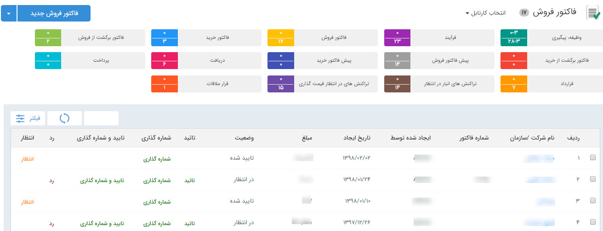

# آیتم های دارای قابلیت تایید    

**کارتابل آیتم های دارای قابلیت شماره گذاری و تایید**

این کارتابل ها عبارتند از: کارتابل پیش فاکتورها، فاکتورها، فاکتورهای برگشتی، دریافت ها،پرداخت ها و قراردادها که نیاز به تایید و شماره گذاری توسط کاربر دارای مجوز دارند.

در صورتی که از قسمت [تنظیمات](../../Setting.md)، [شخصی سازی CRM](../../Setting/Personalizing.md) ، تیک مربوط به نیاز به تایید یا نیاز به شماره گذاری هر کدام از این آیتم ها را انتخاب نموده باشید، بعد از صدور هر کدام از این آیتم ها توسط کارشناسان به تایید/شماره گذاری نیاز خواهند داشت. کاربر دارای مجوز تایید یا شماره گذاری آن آیتم شخصی است که می تواند از طریق این صفحه کلیه آیتم های صادر شده را مشاهده، بررسی و تایید/شماره گذاری و یا رد نماید.

نکته: پس از تایید پیش فاکتور، فاکتور، فاکتور برگشتی و یا قرارداد، آن آیتم قابلیت تغییر یا حذف نخواهد داشت مگر از سمت کاربر دارنده مجوز حذف پس از تایید و یا " مجوزمدیر فروش".

نکته: پس از تایید دریافت و یا پرداخت، این آیتم های مالی قابلیت حذف را تنها از سمت کاربر دارنده مجوز حذف پس از تایید و یا  "مدیر مالی" دارند.

با کلیک بر روی هر کدام از سطر ها، آیتم مربوط به مشتری بازخواهد شد و با زدن دکمه های شماره گذاری،تایید و رد در بالای صفحه ، می توانید آن را تایید/شماره گذاری یا رد نمایید .

نکته: می توانید برای اطلاع مسئول و یا ثبت کننده آیتم از تایید و یا رد آیتم موردنظر، پیامی را از طریق تنظیمات،  [مدیریت پیام های سیستم](HelpPayamgostar\Setting\SystemMessagesManagement.md) تنظیم کنید.

