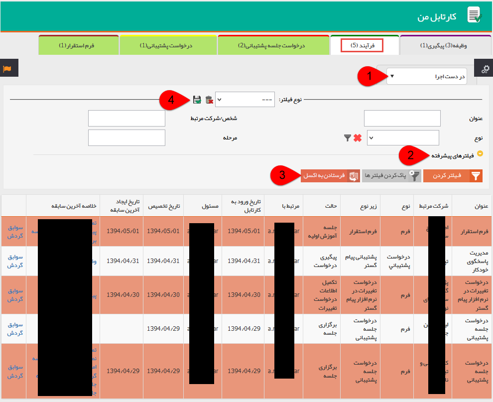
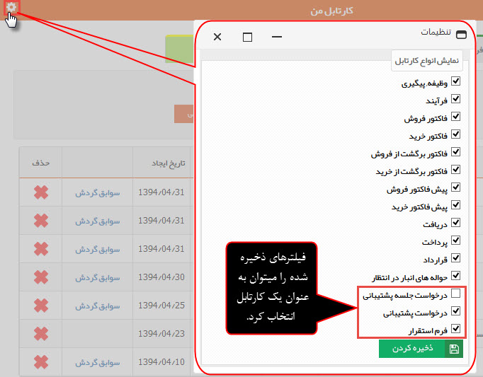

# فرآیندها    

**فرآیندها**

در این قسمت فرآیندهایی که در گردش کاری به دست کاربر رسیده است، نمایش داده میشود.

در صورتی که مسئول کارتابل گروهی باشد که نام کاربری شما در آن گروه عضو است، این فرآیند علاوه بر کارتابل شما در کارتابل سایر اعضای گروه نمایش داده می شود. هر کدام از اعضا می توانند با باز کردن فرآیند و زدن دکمه اختصاص به من، فرآیند را از آن خودکنند.

1\. در دست اجرا: می توانید فرآیندهایی که در مرحله شما قرار گرفته اند و یا از طرف شما ارجاع داده شده اند را مشاهده کنید.

2\. فیلترهای پیشرفته: می توانید برای یافتن فرآیند دلخواه از فیلترهای پیشرفته استفاده کنید.

3\. فرستادن به اکسل: می توانید از لیست فرآیندها را به صورت اکسل خروجی تهیه نمایید.

4\. نوع فیلتر: میتوانید فیلترهای اعمال شده را به عنوان یک فیلتر اختصاصی خود ذخیره کنید.

نکته: هر فیلتر ذخیره شده را می توانید به صورت یک کارتابل مخصوص خود ایجاد نمایید. پس از ذخیره فیلتر با استفاده از آیکون چرخ دنده برای اضافه کردن این فیلتر به عنوان یک کارتابل جدید استفاده کنید.

