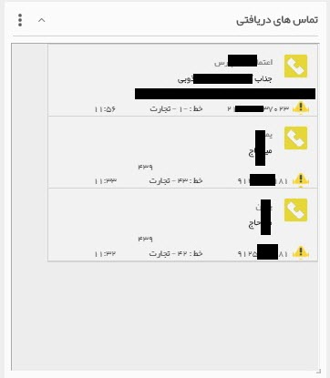
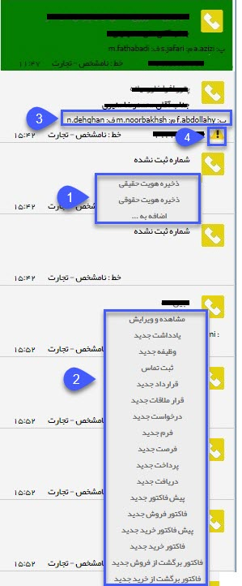

# تماسهای دریافتی    

**تماس های دریافتی** 

با استفاده از این ویجت می توانید لاگ تماس های دریافتی را مشاهده کنید. این ویجت همانند [پنجره تماس های دریافتی](../ColorIDWindow.md) کار می کند.

 

با استفاده از این پنجره می توانید تماس های دریافتی خود را مدیریت کنید. اگر شماره تماس گیرنده قبلاً در یکی از پروفایل های بانک اطلاعاتی ذخیره شده باشد می توانید به راحتی به پروفایل آن دسترسی داشته باشید و یا سابقه جدیدی مرتبط با آن ثبت کنید. همچنین در این پنجره مسئولان مرتبط و رنگ تخصیص داده شده به پروفایل تماس گیرنده نیز نمایش داده می شود. با استفاده از امکانات این پنجره می توانید ارتباط بهینه تری با مخاطبان خود داشته باشید. بطور مثال بر اساس رنگ تخصیص داده شده به مخاطب، نحوه مکالمه خود را تغییر دهید. علاوه بر این می توانید شماره های ثبت نشده را به راحتی به پروفایل یکی از هویت ها اضافه کنید یا یک هویت جدید برای آن ایجاد کنید.

1 . برای شماره های ثبت نشده دو حالت پیش می آید :

الف) این شماره متعلق به یکی از مشتریان ثبت شده در سیستم باشد ولی با شماره جدیدی تماس گرفته باشد. در این صورت از گزینه اضافه به... استفاده می کنیم و با جستجوی پروفایل موردنظر و زدن دکمه انتخاب و بستن، شماره به پروفایل موردنظر اضافه می شود. در انتها دکمه ذخیره کردن را کلیک نمایید تا تغییر در پروفایل ثبت شود .

ب) در صورتی که این شماره تماس مربوط به شرکت جدیدی است، گزینه ذخیره هویت حقیقی و یا ذخیره هویت حقوقی  را انتخاب نمایید و شماره را در دسته بندی مورد نظر  ذخیره نمایید.

2 . اگر شماره تلفن در برنامه پیام گستر ذخیره شده باشد، با نگه داشتن اشاره گر بر روی آیکون تلفن چند گزینه دیده می شود، می توان پروفایل مشتری را مشاهده و یا ویرایش کرد و یا سابقه جدیدی برای آن ثبت کرد. همچنین با کلیک بر روی لینک پروفایل، می توانید به سادگی به صفحه پروفایل این هویت دسترسی داشته باشید.

3\. در صورتی که به پروفایل تماس گیرنده کارشناس فروش، پشتیبانی و متفرقه تخصیص داده باشید، نام کاربری کارشناسان مرتبط در هنگام تماس نمایش داده خواهد شد.

4\. در صورتی که در کنار شماره تماس، علامت مثلث زرد رنگ نمایش داده شود، به این منظور است که این شماره در پروفایل دیگری به جز این پروفایل ثبت شده است.

نکته: در مورد تماس های دریافتی پروفایل های ثبت شده، در صورتی که مسئول پروفایل (فروش، پشتیبانی و یا متفرقه) شما باشید، آیکون تلفن به رنگ سبز رنگ نمایش داده خواهد شد.

نکته: در صورتی که ماژول مخاطبان ناشناس را تهیه نموده باشید و از قسمت تنظیمات، تنظیمات کلی، مخاطبان ناشناس آن را فعال نموده باشید (برای اطلاعات بیشتر به لینک[مخاطبان ناشناس](../Setting/TotalSetting/AnonymousAudience.md) مراجعه نمایید). تماس هایی که از شماره های ناشناس صورت گیرد به صورت یک پروفایل در دسته بندی مشخص شده در تنظیماتثبت می شوند.