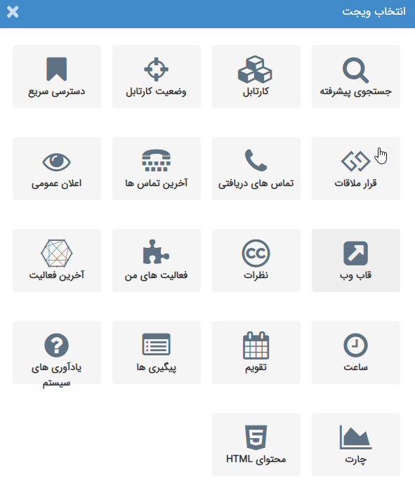

# ویجت

**(Widget)** **ویجت**

ویجت­ها جهت دسترسی سریع تر به برخی از قسمت های نرم افزار می­توانند مورد استفاده قرار گیرند، همچنین برخیاز ویجت­ها ماننداعلان عمومی وقاب وب امکاناتی در اختیارتان قرار می­دهند کهصرفاً از طریق ویجت قابل انجام است. هر کاربر بنا بر نیاز می­تواند ویجت های مورد نظر خود را به صفحه اصلی کاربری خود در نرم افزار اضافه نماید.

****

انواع ویجت های پیام گستر به شرح زیر می باشند:

[**جستجوی پیشرفته**](http://www.payamgostar.com/support/help/v3/index.md?page=HelpPayamgostar/Home/Home/Advancedsearch.md)

[**کارتابل**](http://www.payamgostar.com/support/help/v3/index.md?page=HelpPayamgostar/Home/Home/CourseOfPresentation.md)

[**وضعیت کارتابل**](http://www.payamgostar.com/support/help/v3/index.md?page=HelpPayamgostar/Home/Home/Cardtablecondition.md)

[**دسترسی سریع**](http://www.payamgostar.com/support/help/v3/index.md?page=HelpPayamgostar/Home/Home/quickaccess.md)

[**قرار ملاقات**](http://www.payamgostar.com/support/help/v3/index.md?page=HelpPayamgostar/Home/Home/Appoinment.md)

[**تماس های دریافتی**](http://www.payamgostar.com/support/help/v3/index.md?page=HelpPayamgostar/Home/Home/Incomingcalls.md)

[**آخرین تماس ها**](http://www.payamgostar.com/support/help/v3/index.md?page=HelpPayamgostar/Home/Home/Recentcalls.md)

[**اعلان عمومی**](http://www.payamgostar.com/support/help/v3/index.md?page=HelpPayamgostar/Home/Home/Publicannouncement.md)

[**قاب وب**](http://www.payamgostar.com/support/help/v3/index.md?page=HelpPayamgostar/Home/Home/Webchart.md)

[**نظرات**](http://www.payamgostar.com/support/help/v3/index.md?page=HelpPayamgostar/Home/Home/Comments.md)

[**فعالیت های من**](http://www.payamgostar.com/support/help/v3/index.md?page=HelpPayamgostar/Home/Home/Myrecentactions.md)

[**آخرین فعالیت**](http://www.payamgostar.com/support/help/v3/index.md?page=HelpPayamgostar/Home/Home/Lastactivity.md)

[**ساعت**](http://www.payamgostar.com/support/help/v3/index.md?page=HelpPayamgostar/Home/Home/Time.md)

[**تقویم**](http://www.payamgostar.com/support/help/v3/index.md?page=HelpPayamgostar/Home/Home/Calendar.md)

[**پیگیری های امروز**](http://www.payamgostar.com/support/help/v3/index.md?page=HelpPayamgostar/Home/Home/Todayfollowps.md)

[**یادآوری های سیستم**](http://www.payamgostar.com/support/help/v3/index.md?page=HelpPayamgostar/Home/Home/Systemnotifications.md)

[**چارت**](http://www.payamgostar.com/support/help/v3/index.md?page=HelpPayamgostar/Home/Home/Chart.md)

[**محتوای HTML**](http://www.payamgostar.com/support/help/v3/index.md?page=HelpPayamgostar/Home/Home/Htmlcontent.md)