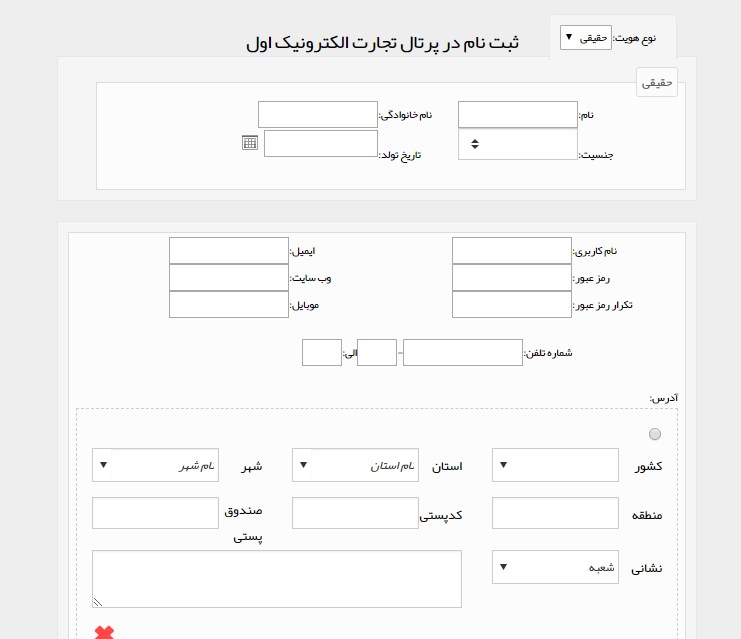
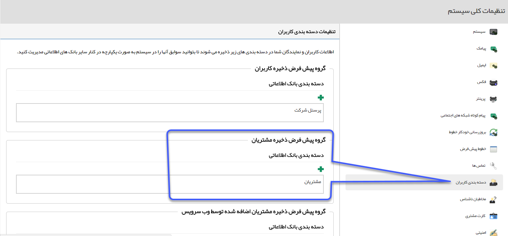

# ایجاد نام کاربری        

**ایجاد نام کاربری**

در باشگاه مشتریان، شما می توانید برای مشتریان و مخاطبان نام کاربری تعریف کنید .

برای عضویت مشتریان در این باشگاهاز سه طریق می توان اقدامکرد:

> الف) از طریق قسمت[مدیریت اعضای باشگاه مشتریان](../../Setting/Customersclubmanagement.md) در تنظیمات.
> 
> ب)  برای مشتریان و مخاطبانی که اطلاعاتشان در سیستم CRM  ذخیره شده است با ورود به صفحه مشخصات آن مخاطب و کلیک بر روی نام کاربری، برای مخاطب نام کاربری و گذر واژه بسازید. از این پس مخاطب شما می تواند با نام کاربری و گذرواژه اش وارد سیستم شده و صفحه پروفایل خود را ببیند.
> 
> ج) همچنین می توان در تنظیمات کلی، قسمت امنیتی، امکان ثبت نام در باشگاه مشتریان را فعال نمود. در این صورت هر شخصی که آدرس URL نرم افزار شما را داشته باشد میتواند در باشگاه مشتریان ثبت نام کرده و از امکانات آن بهره مند گردد.
> 
> 

با فعال کردن گزینه نمایش داده شده، در صفحه ورود به نرم افزار لینک ثبت نام نمایش داده خواهد شد، همن طور که مشاهده می کنید میتوانید وارد کردن برخی از فیلدها را در فرم ثبت نام اجباری کنید.

پس از اینکه مشتری بر روی ثبت نام کلیک کند صفحه زیر نمایش داده خواهد شد  :

برای مشتریانی که در باشگاه مشتریان ثبت نام می کنند، پروفایلی در گروهی که در [تنظیمات کلی](../../Setting/TotalSetting/UsersCategory.md) ، تنظیم کرده اید ایجاد می شود .

