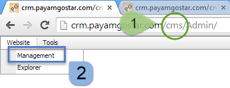

# وارد شدن به ابزار سایت ساز    

**وارد شدن به ابزار سایت ساز**

**1.** با وارد کردن عبارت CMS در جلوی آدرس CRM خود وارد ابزار سایت ساز می شوید.

2\. با زدن دکمهwebsite و بعد از آن management می توانید قسمت های مختلف باشگاه مشتریان و وب سایت خود را تغییر دهید.