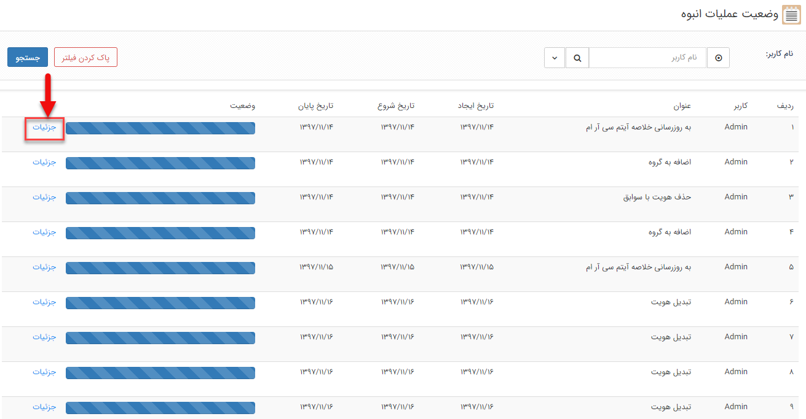
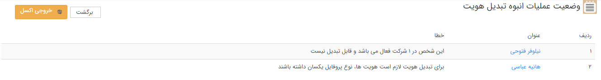

# وضعیت عملیات انبوه

**وضعیت عملیات انبوه**

در مواردی که کاربر اقدام به انجام عملیاتی به صورت گروهی و با تعدد بالا می کند، این عملیات در صف اجرا قرار گرفته و کاربر می تواند در بخش "وضعیت عملیات انبوه" روال انجام عملیات را مشاهده نماید.

برای مشاهده مشکلات احتمالی انجام عملیات انبوه، روی گزینه جزئیات کلیک کنید.

  
