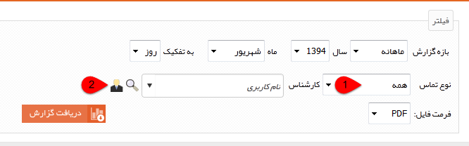

# موارد مشترک گزارش تماس ها    

موارد مشترک گزارش تماس ها

لطفا ابتدا قسمت [اطلاعات مشترک گزارشات](../../Reportscommoninfo.md) را مطالعه کنید.

موارد مشترک بین گزارشات تماس ها به شرح زیر است:

  

1\. نوع تماس: می توانید نوع تماس (ورودی، خروجی، از دست رفته) را تعیین کنید.

2\. کارشناس: تماس هایی که با داخلی یک کارشناس بر قرار شده است را می توانید برای گزارش گیری انتخاب کنید.