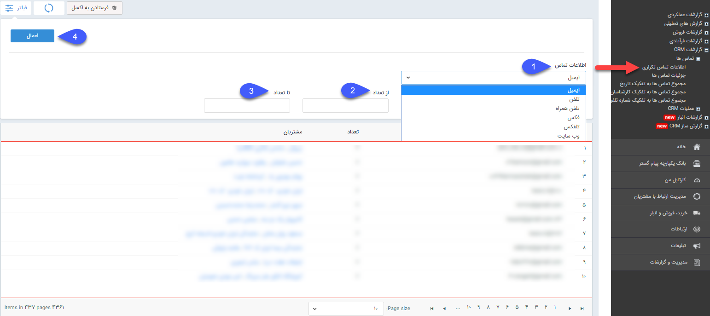

# اطلاعات تماس تکراری

**اطلاعات تماس تکراری**

در این قسمت می توانید گزارشی از هویت هایی که اطلاعات تکراری دارند (ایمیل و تلفن و موبایل و فکس و ....) دریافت کنید.

1. در این قسمت انتخاب کنید که بر اساس کدام اطلاعات تماس تکراری قصد گزارش گیری دارید.

2. در این قسمت انتخاب کنید که حداقل تعداد اطلاعات تکراری مدنظر شما از چه تعدادی شروع می شود.

3. در این قسمت انتخاب کنید که حداکثر تعداد اطلاعات تکراری مدنظر شما چه تعدادی است .

4. فیلتر مورد نظر خود را اعمال کنید و گزارش را دریافت کنید.