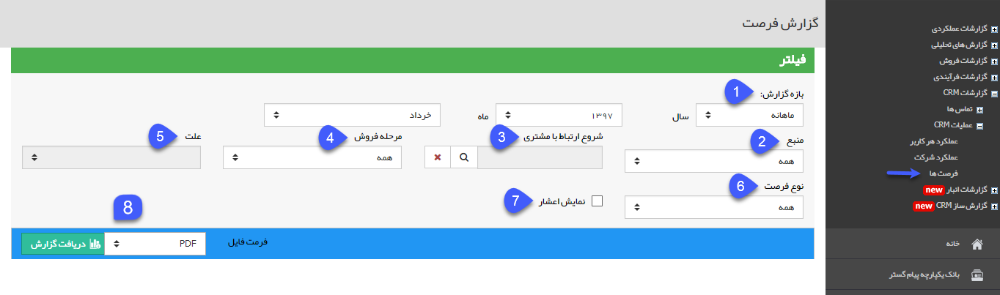
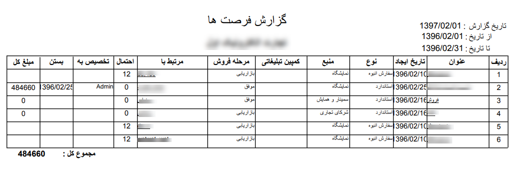

# فرصتها    

  
**فرصتها**

در این گزارش، شما لیستی از تمامی فرصتهایی که ایجاد کرده اید، را خواهید دید. می توانید با استفاده از فیلترهای موجود، گزارش فرصت های ایجاد شده در بازه های زمانی مختلف با مشخصه های مورد نظر خود را دریافت نمایید. استفاده از این گزارش می تواند برای شناسایی علل شکست و موفقیت انواع فرصت ها در بازه های زمانی مختلف مفید باشد.

 

1\. **بازه گزارش:** در این قسمت می توان بازه زمانی دلخواه جهت گزارش دهی را تعیین نمود. این بازه می تواند بصورت ماهانه، سالیانه و یا یک بازه دلخواه باشد که در فیلد اول قابل انتخاب است.

2\. **منبع:** منبع ایجاد فرصت را انتخاب کنید (به طور مثال برای دریافت گزارش تمامی فرصت هایی که از طریق سمینار و همایش ایجاد شده اند)

3.  **شروع ارتباط با مشتری:** در صورت نیاز می توانید با انتخاب یکی از کمپین های تبلیغاتی تعریف شده در این قسمت، گزارش فرصت های مرتبط شده با آن کمپین را دریافت نمایید.

4\. **مرحله فروش:** مرحله فروش فرصت را انتخاب کنید (به طور مثال تمامی فرصت های موفق یا تمامی فرصت هایی که در مرحله مذاکره اولیه قرار دارند) 

5\. **علت:** اگر مرحله فروش بر روی موفق و یا ناموفق باشد، علت موفقیت و یا شکست فرصت را می توانید انتخاب کنید.

6\. **نوع فرصت:** نوع فرصت مورد نظر را تعیین کنید (به طور مثال تمامی فرصت های از نوع سفارش انبوه) 

7\. **نمایش اعشار:** با فعال نمودن این گزینه، مبلغ کل فرصت ها در خروجی گزارش با دو رقم اعشار نمایش داده خواهد شد.

8\. **دریافت گزارش:** پس از اعمال فیلترهای مورد نظر خود، فرمت فایل خروجی گزارش را مشخص نموده و روی دریافت گزارش کلیک کنید تا گزارش جزئیات فرصت ها دانلود شود. همان طور که در زیر مشاهده می کنید، هر ردیف از خروجی این گزارش نشان دهنده یک فرصت فروش است و به ازای آن می توانید جزئیات مربوطه را مشاهده کنید. همچنین با کلیک بر لینک هرکدام از فرصت ها در ستون "عنوان" یا کلیک بر روی لینک پروفایل مرتبط با فرصت در ستون "مرتبط با" به صفحه آن فرصت یا پروفایل هویت مرتبط با آن دسترسی داشته باشید.

