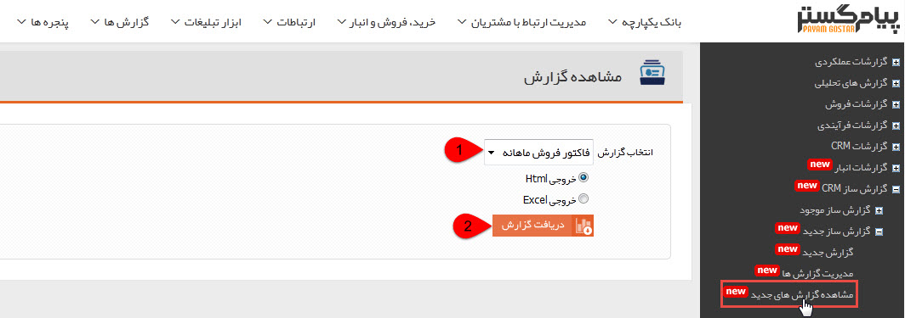
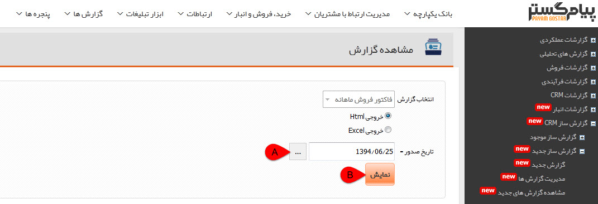

# مشاهده گزارش های جدید        

مشاهده **گزارش های ساخته شده**

در این قسمت می توانید گزارش های موجود را به شکل اکسل و یا صفحه وب دریافت کنید.

1\. انتخاب گزارش: نام گزارش و فرمت دریافتی آن را تعیین کنید.

2\. دریافت گزارش: می توانید گزارش انتخاب شده را، دریافت کنید.

نکته: اگر در گزارش انتخاب شده فیلتری از نوع پارامتر انتخاب شده باشد:

A. مقدار پارامترهای موجود در گزارش را تعیین کنید.

B. نمایش: با کلیک بر روی این دکمه، گزارش انتخاب شده را دریافت می کنید.