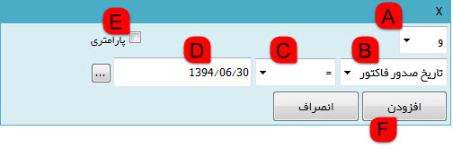
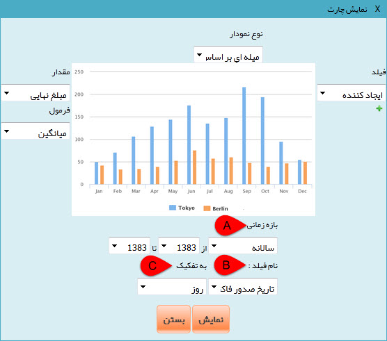
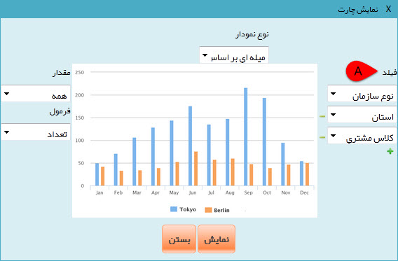
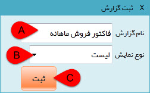

# گزارش جدید        

گزارش ساز جدید

در این قسمت می توانید بر اساس آیتمهایسیستمی گزارش خود را تهیه نمایید.

1. دریافت آنی:با فعال  کردن این گزینه با هر فیلتری که انجام می شود پیش نمایش آن را بلافاصله می توانید  مشاهده کنید .

2.نمایش صفحه آخر: با فعال کردن این گزینه در پیش نمایش  آن گزارش علاوه بر صفحه اول،تمامی اطلاعات تا صفحه آخر را می توانید مشاهده  کنید .

3.  آیتم مورد نظر (استان، شهر، فاکتور، قرار داد و ...) را انتخاب کنید .

4\. نوع آیتم را انتخاب کنید.

5\. پس از انتخاب تعدادی از آیتم ها، نام آنها در این قسمت نمایش داده می شود.

6\. در صورت نیاز می توانید سایر فیلترهای مورد نظر خود را برای این گزارش از این قسمت اضافه کنید.

  A. رابطه منطقی این فیلتر دلخواه با سایر فیلتر های را می توانید تعیین کنید.

  B. انتخاب فیلد: فیلد مورد نظر را می توان از این قسمت کنید.

  C.نوع شرط(مساوی، بزرگتر، کوچکتر و ...) را می توانید برای مقدارفیلد مورد نظر انتخاب کنید.

  D. مقدار عبارت را درج کنید.

  E. پارامتری: با انتخاب این گزینه به جای مقدار عبارت، باید یک نام برای پارامتر برگزینید. پس از ذخیره و هنگام دریافت این گزارش باید مقدار این عبارت را تعیین کنید. (به قسمت [مشاهده گزارش های جدید](MoshahedeyeGozareshha.md) مراجعه کنید.)

 7. تنظیم ستون ها: ا ز طریق این قسمت می توانید ستون ها پیش نمایش را به دلخواه تغییر دهید. (با گزینه "انتخاب همه" تمامی اطلاعات موجود در ستون ها دیده می شود.)

8\. دریافت اطلاعات: با استفاده از این دکمه می توانید اطلاعات پیش نمایش را بازخوانی (Refresh) کنید.

9\. نمایش نمودار: با استفاده از این دکمه می توانید نمودارهای مختلفی از گزارش مورد نظر را مشاهده نمایید. این نمودار ها شامل سه زیر نوع است:

**الف) دایره ای:** تنظیمات نمودار دایره ای به شرح زیر است:

A. فیلد: تعیین کنید که نمودار بر چه اساسی باید اطلاعات را دسته بندی کند. (برای مثال در شکل نمودار بر اساس نوع سازمان نمایش داده خواهد شد.)

B. مقدار: تعیین کنید که نمودار بر اساس کدام مقدار باید اطلاعات را تخصیص دهد.

C. فرمول: فرمول محاسبه مقدار (میانگین، جمع، حداقل، حداکثر) را تعیین کنید.

**ب) میله ای بر اساس زمان:** لطفا ابتدا نوع الف (نمودار دایره ای) را مطالعه کنید.

A. بازه زمانی: بازه زمانی مورد نظر برای تهیه نمودار را انتخاب کنید.

B. نام فیلد: تاریخی که نمودار بر اساس آن باید تشکیل شود، را انتخاب کنید.

C. به تفکیک: نوع تفکیک نمودار (روز، ماه، فصل، سال) را تعیین کنید.

**ج) میله ای بر اساس فیلد:** لطفا ابتدا نوع الف (نمودار دایره ای) را مطالعه کنید.

A. فیلد: در این حالت می توانید چندین پارامتر مختلف را برای نمایش در نمودار دریافتی تعیین کنید.

10\. ثبت گزارش: با استفاده از این دکمه می توانید گزارش را برای مراجعات بعدی خود ذخیره کنید.

A. نام گزارش: نام گزارش را درج نمایید.

B. نوع نمایش: نوع نمایش گزارش (لیست، میله ای، دایره ای) انتخاب کنید.

C. ثبت: گزارش انتخاب شده را ثبت کنید.

11\. فرستادن به اکسل(Excel): با استفاده از این دکمه می توانید خروجی گزارش را به عنوان یک فایل اکسل ذخیره کنید.