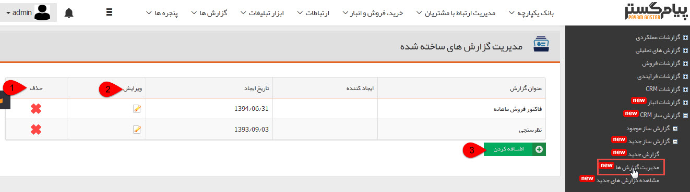

# مدیریت گزارش ها        

**مدیریت گزارش های ساخته شده**

در این قسمت می توانید گزارش های موجود را به دلخواه ویرایش و یا حذف کنید.

1\. حذف: می توانید گزارش دلخواه را حذف کنید.

2\. ویرایش: می توانید یک گزارش را ویرایش کرده و تغییرات مورد نیاز را در آن اعمال کنید.

3\. اضافه کردن: می توانید یک [گزارش جدید](NewReport.md) ایجاد کنید.