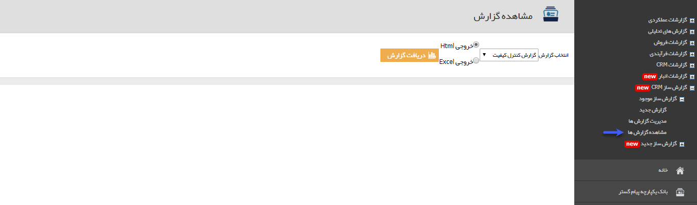

# مشاهده گزارش ها        

مشاهده گزارش ها

در این قسمت می توانید گزارش های ساخته شده را مشاهده کنید. گزارش های از نوع لیست چاپی با دو فرمت Html و Excel و گزارشات از نوع نمودار میله ای و دایره ای با فرمت Html قابل دریافت هستند.

ابتدا از لیست گزارشات ساخته شده، گزارش مورد نظر خود را انتخاب کنید و پس از انتخاب فرمت خروجی گزارش (در صورتی که گزارش از نوع لیست چاپی باشد)، روی دکمه دریافت گزارش کلیک کنید تا خروجی گزارش را مشاهده کنید.

 