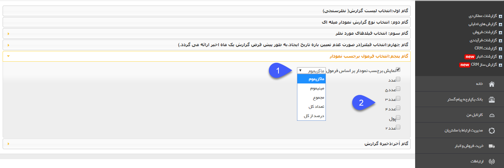
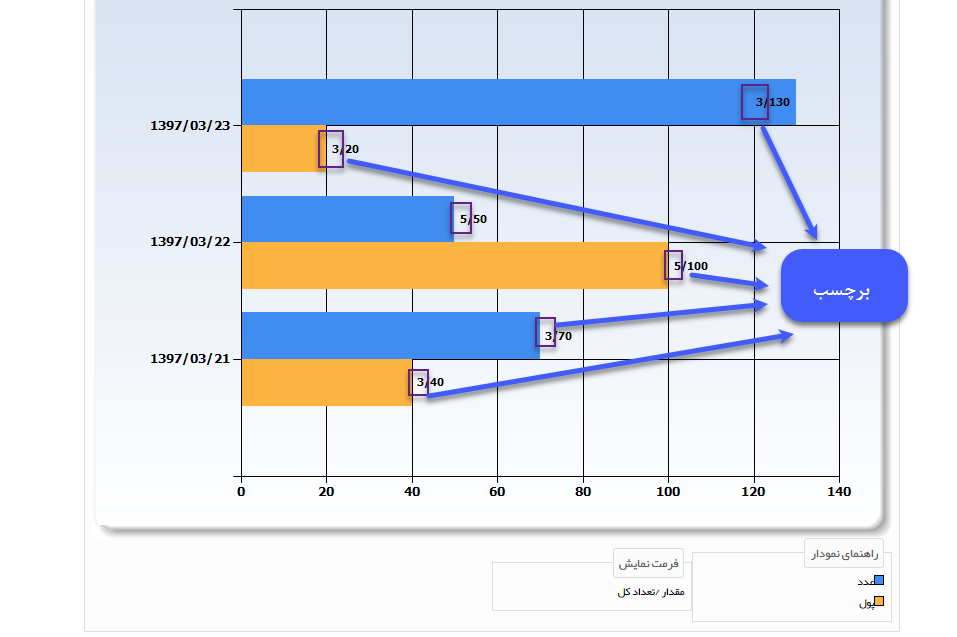

# گام پنجم    

گام پنجم

نکته مهم: این گام تنها در صورت انتخاب نمودار میله ای و دایره ای در گام دوم نمایش داده خواهد شد و برای گزارش از نوع لیست چاپی کاربردی ندارد.

در صورتی که بخواهید در این گام می توانید تنظیماتی اعمال کنید که برای هرکدام از ردیف های نمودار میله ای یا هرکدام از قسمت های نمودار دایره ای، یک برچسب نمایش داده شود که این برچسب می تواند نمایش دهنده ی ماکسیموم یا مینیموم مقدار ثبت شده برای یکی از فیلدها، مجموع مقادیر وارد شده برای یکی از فیلدها، تعداد کل سوابق ثبت شده یا درصد هر ردیف/قسمت از کل سوابق ثبت شده باشد.

  

1\. **نمایش برچسب نمودار بر اساس فرمول:** در این قسمت مشخص کنید که برچسب نمودار چه اطلاعاتی را نمایش دهد، توجه داشته باشید در صورتی که ماکزیموم، مینیموم و مجموع را انتخاب کنید، باید پس از آن، از بین فیلدهای از نوع عدد و پول موجود در آیتم، یک فیلد را انتخاب نمایید تا برچسب نمودار بر اساس مقادیر وارد شده برای آن فیلد نمایش داده شود. اما در صورت انتخاب تعداد کل و درصد از کل، تعداد کل سوابق ثبت شده از آن آیتم در محاسبات در نظر گرفته خواهد شد و ارتباطی با مقادیر وارد شده برای فیلدها ندارد.

2. در صورت انتخاب یکی از سه گزینه ماکزیموم، مینیموم و مجموع، از بین فیلدهای از نوع عدد و پول آیتم، فیلد دلخواه که فرمول انتخاب شده بر روی آن اعمال می گردد را انتخاب کنید. توجه داشته باشید که تنها قادر به انتخاب یک فیلد می باشید.

**مثال:** شکل زیر خروجی یک گزارش نمودار میله ای از یک فرم را نمایش می دهد که با بازه زمانی ماهانه و به تفکیک روز و با فرمول ماکسیموم تنظیم شده است و ماکسیموم مقدار وارد شده برای دو فیلد از این فرم را در روزهای مختلف با یکدیگر مقایسه می کند. همچنین برچسب نمودار بر اساس فرمول تعداد کل تنظیم شده است، یعنی این برچسب، تعداد سوابق ثبت شده از این آیتم را در روزهای مختلف نمایش می دهد.

 