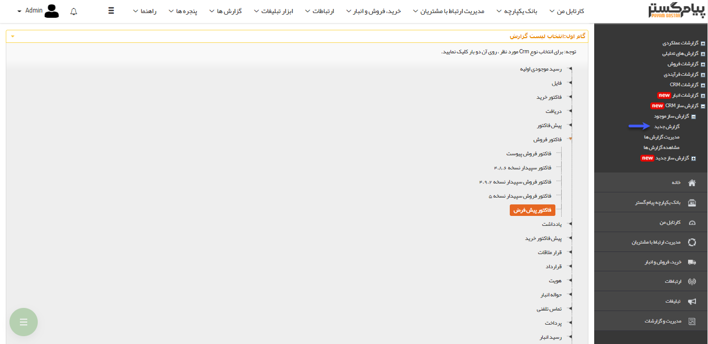

# گام اول    

گام اول

در این گام باید آیتم مورد نظر خود جهت گزارش گیری را انتخاب کنید، همانطور که مشاهده می کنید لیستی از موجودیت های crm در این قسمت نمایش داده می شود و می توانید یک زیرنوع از یکی از موجودیت ها (مثلاً فاکتور پیش فرض یا فرم نظرسنجی از مشتریان) را انتخاب نمایید (این زیرنوع ها همان موارد تعریف شده در قسمت [شخصی سازی](../../../../Setting/Personalizing/Totalview.md) نرم افزار هستند)

ابتدا یکی از انواع موجودیت ها را انتخاب کرده و پس از نمایش لیست زیرنوع های مربوط به آن، روی زیرنوع مورد نظر خود دوبار کلیک کنید تا به گام بعد بروید

