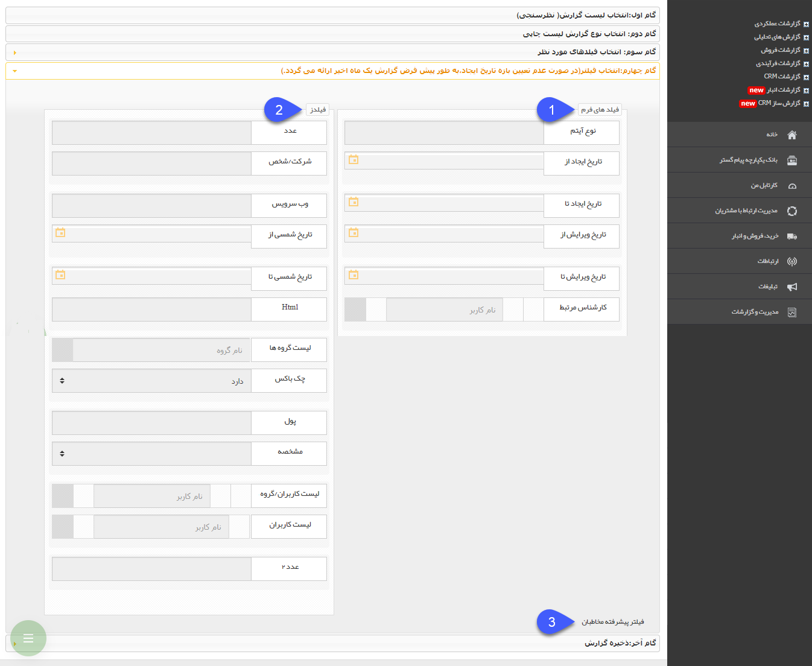

# گام چهارم    

گام چهارم

در این گام می توانید فیلترهای مورد نظر خود را روی فیلدهای آیتم انتخاب شده و همچنین هویت های مرتبط شده با آیتم اعمال کنید. 

نکته: توجه داشته باشید در این قسمت می توانید یک بازه زمانی برای تاریخ ایجاد سوابق در نظر بگیرید، اما در صورتی که این بازه را تعیین نکنید، سیستم به صورت پیش فرض سوابق ثبت شده در یک ماه اخیر را در نظر خواهد گرفت. یعنی اگر به طور مثال یک گزارش برای آیتم فرصت فروش بسازید، هر زمان که از گزارش ساخته شده خروجی بگیرید، فرصت های ثبت شده در ماه اخیر در نظر گرفته می شوند.

1. **فیلدهای پیش فرض:** در این قسمت فیلدهای پیش فرض آیتم انتخاب شده در گام اول نمایش داده می شود و می توانید فیلترهای مورد نظر خود را روی فیلدها اعمال کنید.

2. **فیلدهای اضافه شده:** در این ستون فیلدهای اضافه شده به آیتم از طریق شخصی سازی نمایش داده می شود و می توانید فیلترهای مورد نظر خود را روی فیلدها اعمال کنید.

3\. **فیلتر پیشرفته مخاطبان:** در این قسمت می توانید فیلترهای دلخواه خود را روی هویت های مرتبط شده با آیتم اعمال کنید، در صورت اعمال نکردن فیلتر، سوابق ثبت شده برای تمامی هویت ها در گزارش در نظر گرفته خواهند شد.