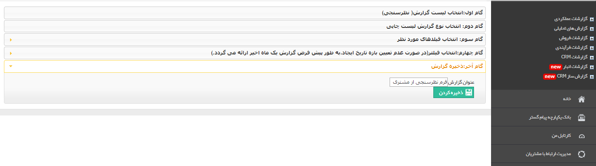

# گام آخر    

گام آخر

در این گام نامی برای گزارش ساخته شده بر گزینید و آن را ذخیره کنید.

پس از ذخیره گزارش ساخته شده می توانید برای مشاهده آن به قسمت [مشاهده گزارش ها](../MoshahedeyeGozareshha.md) مراجعه کنید. همچنین برای ویرایش گزارش های ساخته شده یا حذف آن ها می توانید به قسمت [مدیریت گزارش ها](../ReportsManagement.md) مراجعه کنید.

 