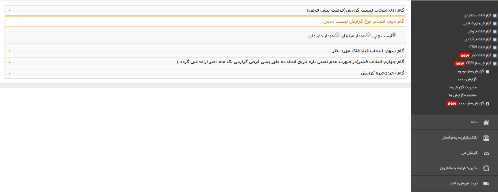

# گام دوم    

گام دوم

در این گام باید نوع گزارش مورد نظر خود را انتخاب کنید. همانطور که مشاهده می کنید سه نوع گزارش می توانید بسازید: لیست چاپی، نمودار میله ای و نمودار دایره ای. بسته به منطق گزارشی که تهیه می نمایید، می توانید یکی از این  سه نوع را انتخاب کنید.

توجه داشته باشید که نمودار میله ای و دایره فقط برای مقایسه فیلدهای از نوع پول، عدد و لیست می باشد.

