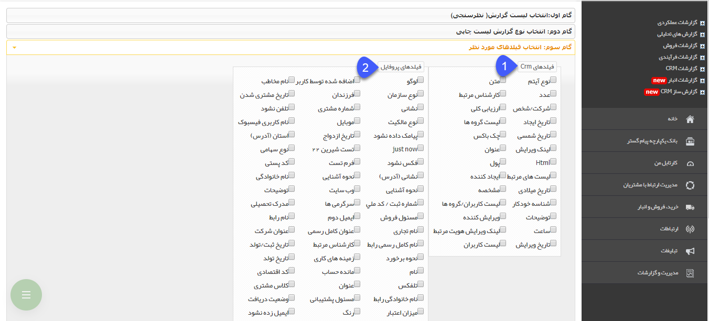
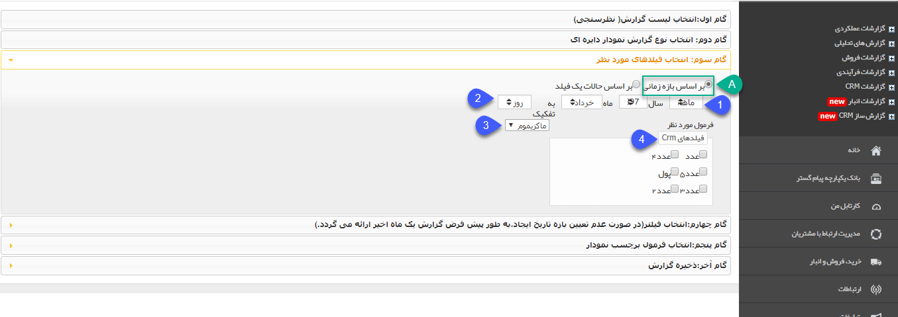
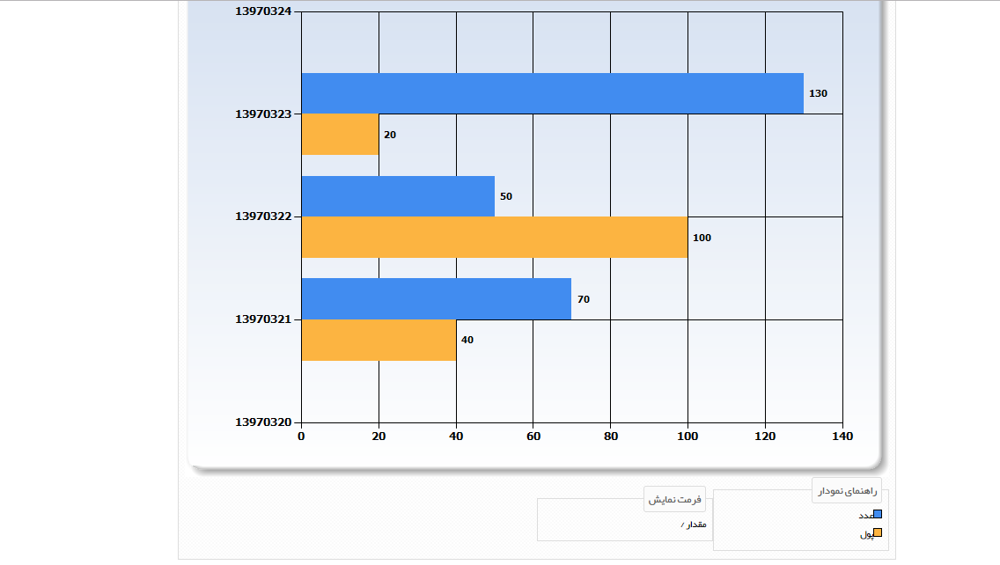
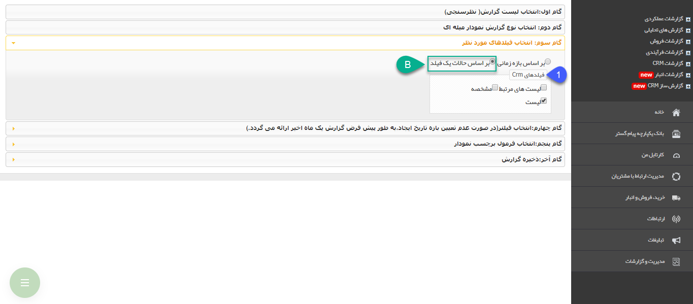
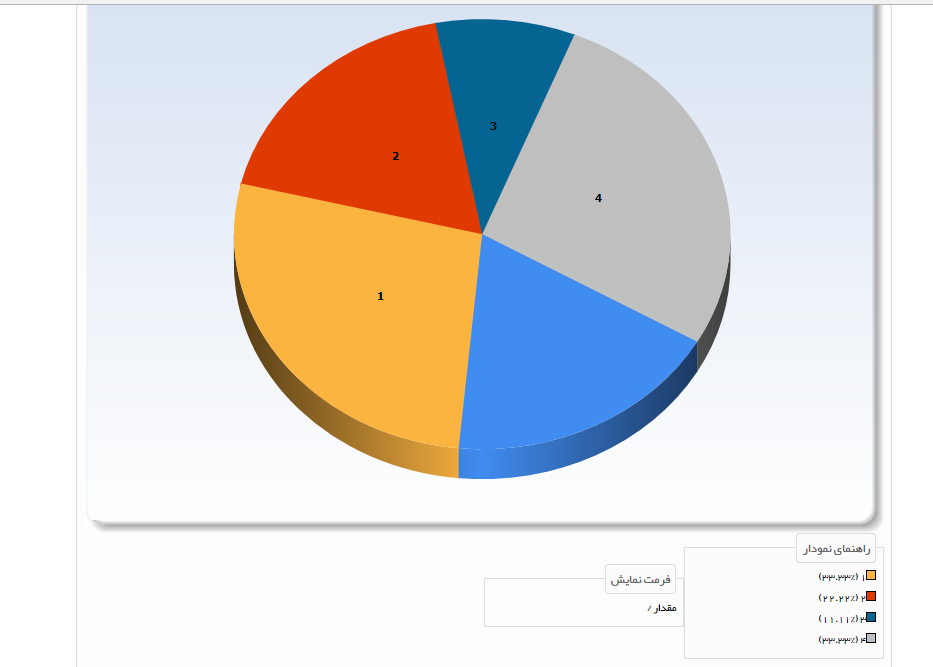

# گام سوم    

گام سوم

 در این گام فیلدهایی که می خواهید از آنها گزارش تهیه کنید را انتخاب نمایید.

**الف) اگر در گام دوم لیست چاپی انتخاب شده باشد:** 

 

1\. **فیلدهای CRM:** فیلدهایی که باید در گزارش قید گردند را انتخاب کنید. در این قسمت می توانید تمامی فیلدهای پیش فرض و فیلدهای اضافه شده به آیتم انتخاب شده در گام اول را انتخاب کنید.

نکته: می توانید علاوه بر فیلدهای آیتم، می توانید ایجاد کننده، آخرین ویرایش کننده، تاریخ ایجاد، تاریخ ویرایش و لینک ویرایش هویت مرتبط را نیز جهت نمایش در گزارش انتخاب کنید. 

نکته: فیلدهای از نوع لیست محصول، لینک، فایل، تصویر و همچنین فیلدهای مرجع (فرم، قرار، فاکتور و ...) در این قسمت قابل انتخاب نیستند.

2\. **فیلدهای پروفایل:** مشخصات مورد نیاز از هویت "مرتبط با" این آیتم که قصد دارید در گزارش ساخته شده نمایش داده شوند را انتخاب کنید.

**ب) اگر در گام دوم نمودار میله ای یا دایره ای انتخاب شده باشد:**

 

A. **بر اساس بازه زمانی:** در صورتی که بخواهید مقادیر وارد شده در فیلدهای از نوع عدد یا پول، یا تعداد ثبت آیتم در روزها یا ماه های مختلف را باهم مقایسه کنید، در این قسمت باید گزینه ی "بر اساس بازه زمانی" را فعال کنید .

> 1\. بازه: بازه زمانی گزارش را تعیین کنید.
> 
> 2\. به تفکیک: نحوه تفکیک مقادیر نمایش داده شده در نمودار گزارش را مشخص کنید، این نحوه تفکیک می تواند با توجه به بازه زمانی انتخاب شده، بر اساس روز، ماه، فصل یا سال باشد.
> 
> 3\. فرمول مورد نظر: از آنجایی که در نمودار گزارش بر اساس نحوه تفکیک انتخاب شده، به ازای هر روز یا ماه تنها یک مقدار برای هر فیلد نمایش داده می شود، در این ق سمت باید فرمول مورد نظر خود برای نمایش مقدار مرتبط با هر روز یا ماه را مقایسه کنید. (به طور مثال فرض کنید که یک فیلد از نوع عدد در یک فرم دارید و در سه فرم ثبت شده در تاریخ 13 شهریور مقادیر 2، 5 و 14 را در این فیلد وارد کرده اید. در صورتی که در این قسمت فرمول مینیموم را انتخاب کرده باشید مقدار 2 برای این روز نمایش داده خواهد شد، همچنین در صورت انتخاب فرمول ماکسیموم مقدار 14 و در صورت انتخاب فرمول مجموع، مقدار 21 در نظر گرفته خواهد شد)
> 
> نکته: توجه داشته باشید فرمول تعداد کل برای مقایسه تعداد آیتم های ثبت شده در روزها یا ماه های مختلف می باشد و ارتباطی با مقدار وارد شده در فیلدهای آیتم ندارد.
> 
> 4\. فیلدهای CRM: در این قسمت فیلدهای از نوع عدد و پول موجود در آیتم انتخاب شده در گام اول نمایش داده می شود و می توانید فیلدهای مورد نیاز را انتخاب کنید. توجه داشته باشید که در صورت انتخاب نمودار میله ای می توانید هر تعداد فیلد مورد نظر خود را در این قسمت انتخاب کنید، اما در صورت انتخاب نمودار دایره ای تنها قادر به انتخاب یک فیلد می باشید. 
> 
> **مثال:** شکل زیر خروجی یک گزارش نمودار میله ای از یک فرم را نمایش می دهد که با بازه زمانی ماهانه و به تفکیک روز و با فرمول ماکسیموم تنظیم شده است و ماکسیموم مقدار وارد شده برای دو فیلد از این فرم را در روزهای مختلف با یکدیگر مقایسه می کند.
> 
>  

 

B. **بر اساس حالات یک فیلد:**  در صورتی که بخواهید مقادیر انتخاب شده در فیلدهای از نوع لیست در سوابق ثبت شده از این نوع آیتم را باهم مقایسه کنید، در این قسمت باید گزینه ی "بر اساس حالات یک فیلد" را فعال نمایید.

1\. فیلدهای CRM: فیلدهای مورد نیاز را انتخاب کنید. در این قسمت تمامی فیلدهای از نوع لیست، لیست های مرتبط و مشخصه ساخته شده در آیتم نمایش داده می شود و در صورتی که در گام قبل نمودار میله ای را انتخاب کرده باشید می توانید هر تعداد فیلد مورد نظر خود را در این قسمت انتخاب کنید، اما در صورت انتخاب نمودار دایره ای تنها قادر به انتخاب یک فیلد می باشید. 

**مثال:** شکل زیر یک نمودار دایره ای برای مقایسه مقادیر وارد شده در یک فیلد از نوع لیست در یک فرم را نمایش می دهد.

> 