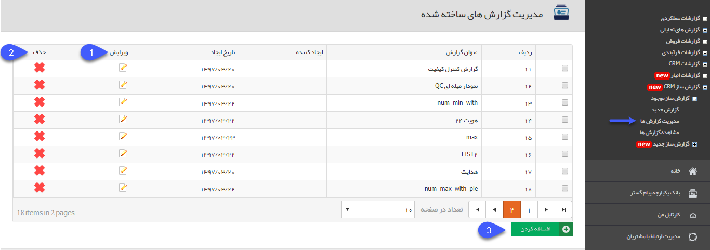
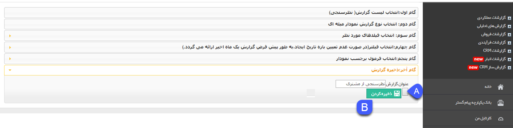

# مدیریت گزارش ها        

**مدیریت گزارش ها**

در این قسمت تمامی گزارش های ساخته شده را می توان ویرایش و یا حذف کرد.

 

1\. **ویرایش:** می توانید گزارش مورد نظر را ویرایش کنید. با کلیک بر روی دکمه ویرایش، می توانید تنظیمات اعمال شده در هریک از گام ها را ویرایش کنید.

 

همان طور که مشاهده می کنید در هنگام ویرایش گزارش در گام آخر، در کنار دکمه ذخیره، دکمه دیگری نیز نمایش داده می شود. این موضوع به این دلیل است که در هنگام ویرایش گزارش، فیلترهای اعمال شده در گام چهارم که در زمان ساخت گزارش تنظیم شده اند نمایش داده نخواهند شد، اما می توانید گزارش را با همان فیلترها ذخیره نمایید.

A. ذخیره با فیلتر قبلی:  با کلیک بر روی این دکمه، گزارش با همان فیلترهای اعمال شده در هنگام ساخت گزارش ذخیره خواهد شد.

B. ذخیره با فیلتر جدید: با استفاده از این دکمه، گزارش با فیلترهای جدید اعمال شده در هنگام ویرایش گزارش، ذخیره خواهد شد.

نکته مهم: توجه داشته باشید در صورتی که فیلترهای گام چهارم را در هنگام ویرایش گزارش تغییر ندهید و از دکمه B استفاده کنید، فیلترهای اعمال شده در هنگام ساخت گزارش ریسِت   (Reset) خواهند شد و فیلترها به حالت پیش فرض (یعنی فیلترهای خالی و بازه تاریخ ایجاد یک ماهه) تغییر خواهند کرد، بنابراین در صورتی که قصد تغییر فیلترهای گام چهارم را ندارید و قصد ویرایش تنظیمات گام های دیگر را دارید، در هنگام ذخیره از دکمه A استفاده کنید تا گزارش با فیلترهای قبلی ذخیره گردد.

2\. **حذف:** در صورت نیاز، می توانید گزارش ذخیره شده را حذف کنید.

3\. **اضافه کردن:** می توانید یک [گزارش جدید](NewReport.md) ایجاد کنید.