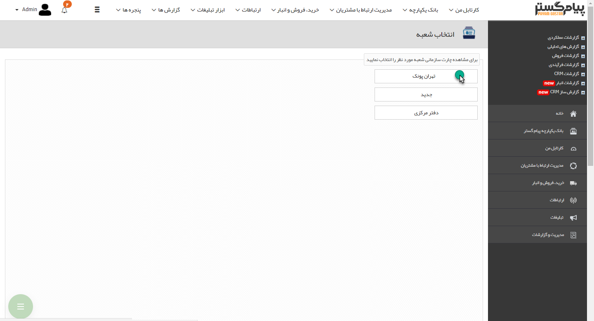
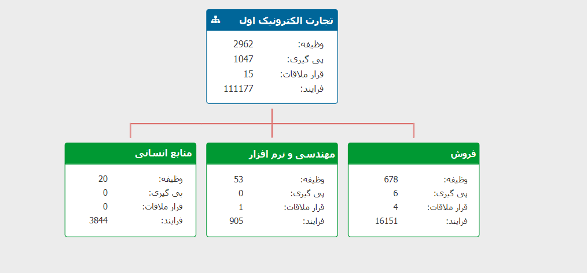

# چارت سازمانی    

**چارت سازمانی**

****

تنظیمات و ویرایش چارت سازمانی از طریق منوی [مدیریت شعب،دپارتمان و سمت](HelpPayamgostar\BaseInformatio\BranchManagement.md) صورت میگیرد و بصورت یک چارت در این گزارش قابل مشاهده خواهد بود. تعداد وظایف، پیگیری ها،

  قرارملاقات ها وفرآیندها بصورت مجموع برای هر دپارتمان مشخص میگردد.

نکته: توجه داشته باشید که آیتم های (وظیفه، فرایند و ...) موجود در کارتابل کاربرانی که به آن ها حکم سازمانی تخصیص نداده باشید در محاسبات این گزارش لحاظ نخواهند شد.

