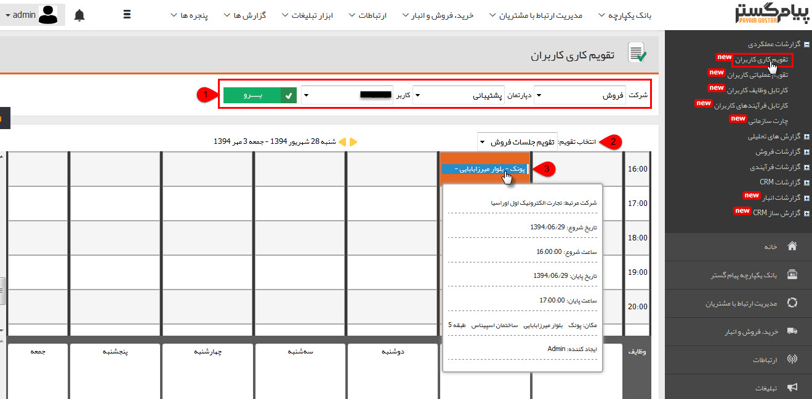

# تقویم کاری کاربران      **

**تقویم کاری کاربران**

**

**در این قسمت می توانید تقویم کاری (قرارملاقاتهای کاربران)، پیگیریهای مرتبط با کاربر را مشاهده کنید.**

**نکته: با دوبار کلیک بر روی هر سلول از این تقویم می توانید یک قرار ملاقات جدید در تاریخ مورد نظر را تنظیم کنید.**

****

**1\. برو: با انتخاب نام کاربر و استفاده از این دکمه، می توانید تقویم های کاری او را مشاهده کنید.**

**2\. انتخاب تقویم: می توانید تقویم هایی که کاربر انتخاب شده به آن دسترسی دارد را مشاهده کنید.**

**3\. با ایستادن اشاره گر بر روی هر کدام از قرار ملاقات ها، اطاعات تکمیلی آن پدیدار میشود.**