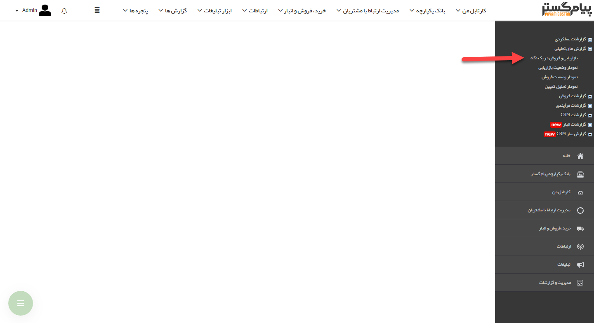
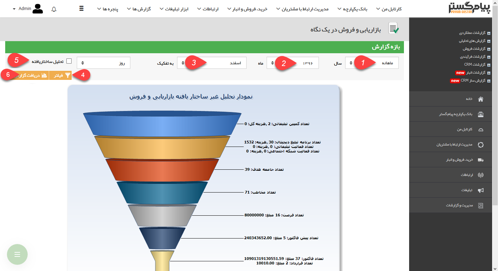
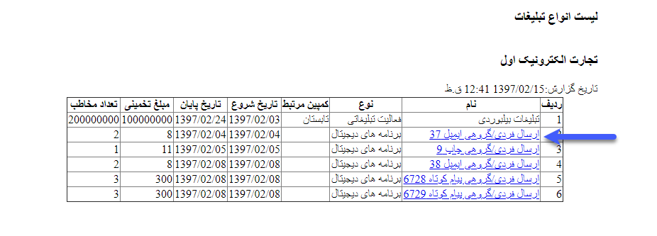

# بازاریابی و فروش در یک نگاه        

**بازاریابی و فروش در یک نگاه**

در این نمودارها می توانید تعداد کمپین ها، برنامه های تبلیغاتی مربوطه،تعداد جامعه هدفارسال شده، مخاطب مرتبط شده و فرصت،پیش فاکتور، فاکتور و قرارداد های مرتبط را به ترتیب و در بازه زمانی قابل انتخاب مشاهده نمایید. همچنین تعداد فعالیت های انجام شده در نرم افزار و تعداد تماس های دریافتی، گرفته شده و از دست رفته را در بازه تعیین شده می توان مشاهده کرد.

 

1. **انتخاب نوع بازه:**بازه زمانی گزارش مورد نظر را تعیین کنید.

2. **انتخاب سال:**سال گزارش در این فیلد مشخص می شود.

3. **انتخاب ماه:** ماه گزارش گیری در این فیلد مشخص می شود.

4. **فیلتر کردن:**با استفاده از این دکمه، بازه زمانی انتخاب شده بر روی گزارش اعمال می گردد.

5. **تحلیل ساختار یافته:**باانتخاب این گزینه نرم افزار تنها آمار مربوط به مخاطبان، فرصت ها، پیش فاکتور و فاکتورهایی را نمایش داده و در گزارش ذکر می کندکه مرتبط با یکی از کمپین های تبلیغاتی شده باشند و از این طریق می توان هزینه ها و منافع کلی یک کمپین تبلیغاتی را به خوبی سنجید.

6. **دریافت گزارش:**می توانید فایل گزارش را در قالب پی دی اف (Pdf) دریافت کنید.

نکته: با کلیک بر روی هرکدام از ردیف های قیف وضعیت بازاریابی و فروش می توانید جزئیات مربوط به آن را مشاهده نمایید.

همچنین با کلیک بر روی لینک موجود در هریک از ردیف های این جدول، می توانید جزئیات برنامه تبلیغاتی یا آیتم مربوطه (فرصت، پیش فاکتور، فاکتور و...) را مشاهده نمایید.